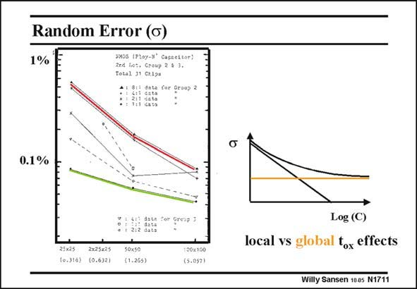

# SANSEN-1711 · Random Error (G) vNos (Ptoy-3* Cagseitor)

章节：17 开关电容滤波器  
PDF 页：480；书本页：490；幻灯片编号：1711  
状态：unreviewed



## 对应教材讲解

### PDF 480 · 书本 490

The random sigma or spreading decreases for increasing capacitor size, as shown in this slide. The actual values have to be checked for each different CMOS technology however. It is clear that 0.2% is not difficult to achieve. For areas larger than 50×50 micrometer, 0.05% is feasible as well. The slope of this curve depends on the ratio of local versus global errors. This is why it is hard to predict. It is preferable to be measured on an extensive number of samples.

## 公式／性能结论候选摘录

以下为规则截取的原文，尚未逐项判读。

- PDF 480: The random sigma or spreading decreases for increasing capacitor size, as shown in this slide.
- PDF 480: The slope of this curve depends on the ratio of local versus global errors.

## 曲线结论候选摘录

以下为规则截取的原文，尚未逐项判读。

- PDF 480: The slope of this curve depends on the ratio of local versus global errors.

## 原文条件与近似候选摘录

以下为规则截取的原文，尚未逐项判读。

（未由规则找到；不代表原页没有此类内容。）

## 幻灯片 OCR（未校正）

```text
Random Error (G)
1%
vNos (Ptoy-3* Cagseitor)
2ed los, Ceoup 24.3.
Total J1 Chlps
: S dets cor graop 2
cata
•1 12i eata
0.1 %
10.316)
(0.6)2)
7 : 4:31
• : 2:2 data
50×50|
{1.265)
Log (C)
local vs global fox effects
130x100
(5.057)
Willy Sansen 1005 N1711
```

数学上下标、分数及正负号以原图为准。电路图已保留；未核对的连接不输出成可仿真 netlist。
