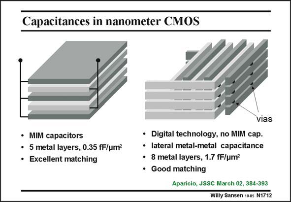

# SANSEN-1712 · Capacitances in nanometer CMOS

章节：17 开关电容滤波器  
PDF 页：480；书本页：490；幻灯片编号：1712  
状态：unreviewed



## 对应教材讲解

### PDF 480 · 书本 490

Nowadays, many metal layers have become available. They can be used as horizontal capacitances or as vertical capacitances. In horizontal capacitances (left), the odd-order plates are connected in parallel to one terminal, and the even order ones to the other terminal. Typical values of the capacitance value obtained are much smaller than what can be obtained with the Gate-oxide capacitance. Their breakdown voltage is higher, however. Matching is also good, depending on size. Vertical capacitances have also become available (right). The lateral-capacitance value is even larger than on the left. Moreover they are available in purely digital CMOS technologies.

### PDF 481 · 书本 491

However, the matching is not as good as for MIM horizontal capacitances (0.5% versus 0.2%, respectively).

## 公式／性能结论候选摘录

以下为规则截取的原文，尚未逐项判读。

- PDF 480: Matching is also good, depending on size.

## 曲线结论候选摘录

以下为规则截取的原文，尚未逐项判读。

（未由规则找到；不代表原页没有此类内容。）

## 原文条件与近似候选摘录

以下为规则截取的原文，尚未逐项判读。

- PDF 480: Typical values of the capacitance value obtained are much smaller than what can be obtained with the Gate-oxide capacitance.

## 幻灯片 OCR（未校正）

```text
Capacitances in nanometer CMOS
vias
• MIM capacitors
• 5 metal layers, 0.35 fF/um?
• Excellent matching
• Digital technology, no MIM cap.
• lateral metal-metal capacitance
• 8 metal layers, 1.7 fF/um?
• Good matching
Aparicio, JSSC March 02, 384-393
Willy Sansen 100s N1712
```

数学上下标、分数及正负号以原图为准。电路图已保留；未核对的连接不输出成可仿真 netlist。
