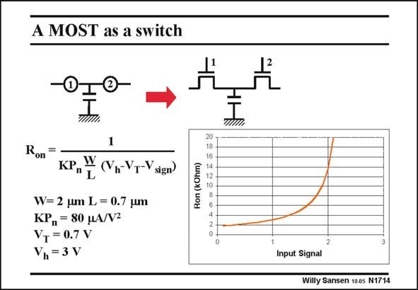

# SANSEN-1714 · A MOST as a switch

章节：17 开关电容滤波器  
PDF 页：481；书本页：491；幻灯片编号：1714  
状态：unreviewed



## 对应教材讲解

### PDF 481 · 书本 491

A switch, which is closed on clock phase W1, is a nMOST which conducts on this phase. This means that its Gate is at a high voltage V h with respect to ground. As a result, its V is high and its GS V is fairly small. This DS MOST is now in the linear region and behaves as a resistor with value R . Its on expression is taken from Chapter 1 and repeated in this slide. For a zero input signal voltage V , the Source on sign the right hand side of the MOST is also zero. In this case, the V −V of the nMOST is V −V . GS T h T This is the largest possible drive voltage. Its R has therefore the smallest possible value. on For larger input signals, the V −V values decrease and the R increases. This is illustrated GS T on for a small switch of 2/0.7 micrometer. For an input signal of about 2.3 V, the V −V becomes GS T zero and the R becomes very large. The MOST does not act any more as a switch! The drive on voltage is insufficient. The clock voltage V is not sufficiently large to turn on the switch! For h such input voltages the clock voltage V must be larger than 3 V! h The maximum signal voltage that can be switched is therefore V −V . h T

## 公式／性能结论候选摘录

以下为规则截取的原文，尚未逐项判读。

- PDF 481: As a result, its V is high and its GS V is fairly small.
- PDF 481: Its R has therefore the smallest possible value. on For larger input signals, the V −V values decrease and the R increases.
- PDF 481: For h such input voltages the clock voltage V must be larger than 3 V! h The maximum signal voltage that can be switched is therefore V −V . h T

## 曲线结论候选摘录

以下为规则截取的原文，尚未逐项判读。

- PDF 481: A switch, which is closed on clock phase W1, is a nMOST which conducts on this phase.

## 原文条件与近似候选摘录

以下为规则截取的原文，尚未逐项判读。

（未由规则找到；不代表原页没有此类内容。）

## 幻灯片 OCR（未校正）

```text
A MOST as a switch
1
Ron
KP"L
- (Vn-VT-Vsign
W= 2 um L = 0.7 um
KP„ = 80 HA/V2
VT = 0.7 V
Vn=3V
Ron (kOhm)
8009004N
Input Signal
Willy Sansen 1005 N1714
```

数学上下标、分数及正负号以原图为准。电路图已保留；未核对的连接不输出成可仿真 netlist。
