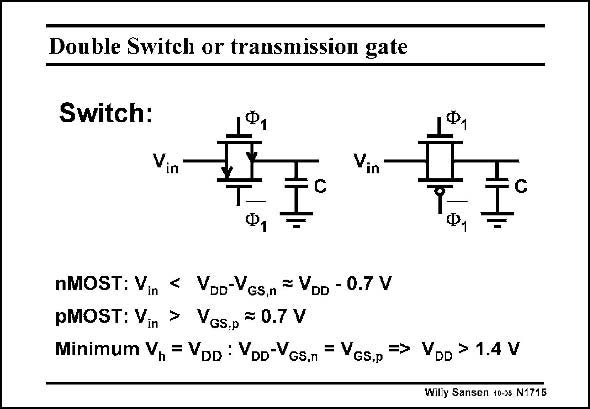

# SANSEN-1715 · Double Switch or transmission gate

章节：17 开关电容滤波器  
PDF 页：482；书本页：492；幻灯片编号：1715  
状态：unreviewed



## 对应教材讲解

### PDF 482 · 书本 492

In order to be able to switch in a larger input voltage, a second transistor must be added, which is a PMOST. It is driven by the opposite clock phase. This is the lowest voltage available, which is usually ground. The nMOST will conduct for lower input voltages, whereas the pMOST will conduct for larger input voltages. This parallel connection will thus always have a low R over the on whole range of input voltages, from zero to supply voltage V . DD This double switch, also called transmission gate, is a good solution for large input voltages. However, it does not work for small supply voltages. For small supply voltages, none of the two MOSTs can conduct. For example, if the minimum voltage V is taken to be the same as the threshold voltage V , or 0.7 V, then the minimum GS T supply voltage is about 1.4 V.

## 公式／性能结论候选摘录

以下为规则截取的原文，尚未逐项判读。

- PDF 482: This parallel connection will thus always have a low R over the on whole range of input voltages, from zero to supply voltage V .

## 曲线结论候选摘录

以下为规则截取的原文，尚未逐项判读。

- PDF 482: It is driven by the opposite clock phase.

## 原文条件与近似候选摘录

以下为规则截取的原文，尚未逐项判读。

（未由规则找到；不代表原页没有此类内容。）

## 幻灯片 OCR（未校正）

```text
Double Switch or transmission gate
Switch:
Ф,
Vin
Vin
Ф,
nMOST: Vin < Voo-Vcs.n = VDD - 0.7 V
pMOST: Vin > VGs.p = 0.7 V
Minimum Vn = VDD : VDD-VGs.n = Vcs.p => VDD > 1.4 V
Willy Sansen 10-3s N1715
```

数学上下标、分数及正负号以原图为准。电路图已保留；未核对的连接不输出成可仿真 netlist。
