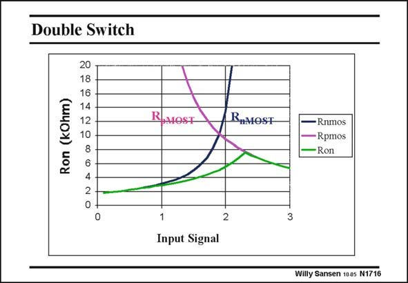

# SANSEN-1716 · Double Switch

章节：17 开关电容滤波器  
PDF 页：482；书本页：492；幻灯片编号：1716  
状态：unreviewed



## 对应教材讲解

### PDF 482 · 书本 492

For a large input voltage, the total on-resistance is the parallel combination of both. These values of R on have been calculated for the same data as before. It is clear that the maximum value of R is about on 8 kV, whatever the input signal is, between zero and 3 V. For small input voltages, the R is even less on than 2 kV. In most cases, the designer knows what the input range will be. It covers the whole supply voltage range. In most cases, it is sufficient to take one switch only, a nMOST one for low input voltages or a pMOST one for high input voltages.

## 公式／性能结论候选摘录

以下为规则截取的原文，尚未逐项判读。

（未由规则找到；不代表原页没有此类内容。）

## 曲线结论候选摘录

以下为规则截取的原文，尚未逐项判读。

（未由规则找到；不代表原页没有此类内容。）

## 原文条件与近似候选摘录

以下为规则截取的原文，尚未逐项判读。

（未由规则找到；不代表原页没有此类内容。）

## 幻灯片 OCR（未校正）

```text
Double Switch
20
18
16
Ron (k0hm)
R
MOST
RIMOST
10
8
2
2
Input Signal
- Rnmos |
•Rpmos
-Ron
3
Willy Sansen 100s N1716
```

数学上下标、分数及正负号以原图为准。电路图已保留；未核对的连接不输出成可仿真 netlist。
