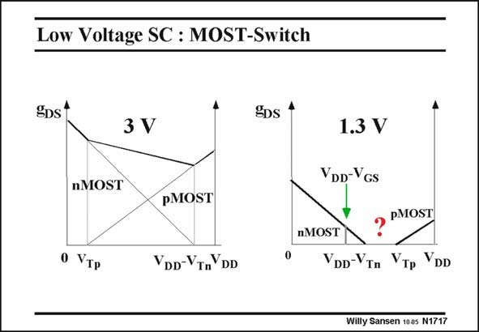

# SANSEN-1717 · Low Voltage SC : MOST-Switch

章节：17 开关电容滤波器  
PDF 页：483；书本页：493；幻灯片编号：1717  
状态：unreviewed



## 对应教材讲解

### PDF 483 · 书本 493

Plotting the conductance of the switches shows clearly where the switches conduct and where they do not. For low input voltages, only the nMOST conducts. For an input signal larger than V , the pMOST starts Tp conducting. For a high supply voltages, there is a large region in the middle where both conduct. For an input signal larger than V −V , the nMOST DD Tn stops conducting. For small supply voltages, there is obviously a region in the middle where none of the MOSTs conduct. The minimum supply voltage would thus be the sum of V and V . Tn Tp How can switches be made to work in the middle if the supply voltage is really small?

## 公式／性能结论候选摘录

以下为规则截取的原文，尚未逐项判读。

- PDF 483: The minimum supply voltage would thus be the sum of V and V .

## 曲线结论候选摘录

以下为规则截取的原文，尚未逐项判读。

- PDF 483: Plotting the conductance of the switches shows clearly where the switches conduct and where they do not.

## 原文条件与近似候选摘录

以下为规则截取的原文，尚未逐项判读。

（未由规则找到；不代表原页没有此类内容。）

## 幻灯片 OCR（未校正）

```text
Low Voltage SC : MOST-Switch
SDs1
EDs 4
3V
nMOST
pMOST
0 VTP
VDD-VTnYDD
1.3 V
YDD-VGs
pMOST
NMOST
YDD-VTn
VTp YDD
Willy Sansen 1005 N1717
```

数学上下标、分数及正负号以原图为准。电路图已保留；未核对的连接不输出成可仿真 netlist。
