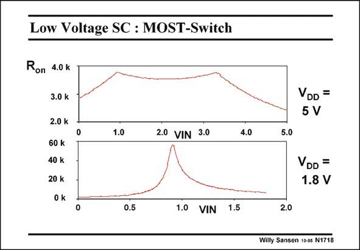

# SANSEN-1718 · Low Voltage SC : MOST-Switch

章节：17 开关电容滤波器  
PDF 页：483；书本页：493；幻灯片编号：1718  
状态：unreviewed



## 对应教材讲解

### PDF 483 · 书本 493

The same message is given when the total on-resistance is plotted rather than the conductance. In this example, both V ’s are close to T 0.9 V. Their sum is about 1.8 V. For a large supply voltage, the on-resistance is always small. For a supply voltage which is a little larger than the sum of the two threshold voltages, the switches do not conduct any more in the middle. The on resistance is too high to be of use for a switch. For large on-resistances, the time constant becomes too long. It takes too much time to fully charge the capacitances, as shown next.

## 公式／性能结论候选摘录

以下为规则截取的原文，尚未逐项判读。

（未由规则找到；不代表原页没有此类内容。）

## 曲线结论候选摘录

以下为规则截取的原文，尚未逐项判读。

- PDF 483: The same message is given when the total on-resistance is plotted rather than the conductance.

## 原文条件与近似候选摘录

以下为规则截取的原文，尚未逐项判读。

（未由规则找到；不代表原页没有此类内容。）

## 幻灯片 OCR（未校正）

```text
Low Voltage SC : MOST-Switch
Ron 4.0 k
3.0 k
2.0 k
60 k
40 k
20 k
0 k
1.0
2.0 VIN 3.0
VDD =
5 V
5.0
VDD =
1.8 V
0.5
1.0 VIN 1.5
2.0
Willy Sansen 10-a5 N1718
```

数学上下标、分数及正负号以原图为准。电路图已保留；未核对的连接不输出成可仿真 netlist。
