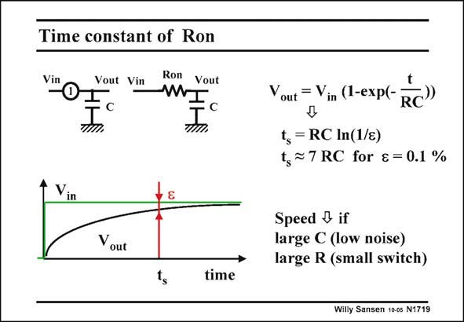

# SANSEN-1719 · Time constant of Ron

章节：17 开关电容滤波器  
PDF 页：484；书本页：494；幻灯片编号：1719  
状态：unreviewed



## 对应教材讲解

### PDF 483 · 书本 493

In such a switch-capacitor filter, we always assume that the charge is fully transferred from one capacitor to the other. Otherwise, the gain accuracy would be lost.

### PDF 484 · 书本 494

It takes time however, to fully charge a capacitor. In theory it takes an infinite time. In practice however a limited number of time constants is sufficient. Charging a capacitor C by means of a constant resistor gives an exponential time response as shown in this slide. The time required to reach the final value within an error of 0.1% is called the 0.1% settling time t . For 0.1% it is the time s constant times ln(1000) or 6.9 or about 7. It takes about 7 times the time constant before the final value is reached within 0.1%. This is a considerable amount of time. For low kT/C noise, larger capacitors will be used and this time will be even longer. For small switches (W=2L) the on resistances are of the order of 10 kV, this time will be longer as well. Half the clock period must now be at least 7 times this time constant. There is therefore a minimum length of clock period and thus a maximum value of clock frequency, as discussed next. Finally, note that the R increases because the V of the MOST decreases when the voltage on GS comes up. The actual time constant will be even larger. Only a circuit simulator can give accurate values.

## 公式／性能结论候选摘录

以下为规则截取的原文，尚未逐项判读。

- PDF 483: Otherwise, the gain accuracy would be lost.
- PDF 484: In practice however a limited number of time constants is sufficient.
- PDF 484: There is therefore a minimum length of clock period and thus a maximum value of clock frequency, as discussed next.
- PDF 484: Finally, note that the R increases because the V of the MOST decreases when the voltage on GS comes up.

## 曲线结论候选摘录

以下为规则截取的原文，尚未逐项判读。

（未由规则找到；不代表原页没有此类内容。）

## 原文条件与近似候选摘录

以下为规则截取的原文，尚未逐项判读。

- PDF 483: In such a switch-capacitor filter, we always assume that the charge is fully transferred from one capacitor to the other.

## 幻灯片 OCR（未校正）

```text
Time constant of Ron
Vout Vin
-
• с
Ron Vout
mI
Vin
Yout
ts
time
Vout = Vin (1-exp(-
RC"
t, = RC In(1/s)
t, ≥7 RC for & = 0.1 %
Speed & if
large C (low noise)
large R (small switch)
Willy Sansen 10-0s N1719
```

数学上下标、分数及正负号以原图为准。电路图已保留；未核对的连接不输出成可仿真 netlist。
