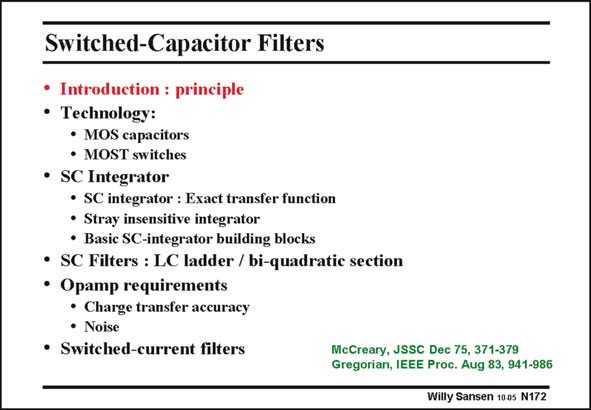

# SANSEN-172 · Switched-Capacitor Filters

章节：17 开关电容滤波器  
PDF 页：475；书本页：485；幻灯片编号：172  
状态：unreviewed



## 对应教材讲解

### PDF 475 · 书本 485

First of all, we will have a look at the principle of a switched capacitor. The main ingredients of such a circuit block are capacitors, switches and opamps. Integrator and full firstand second-order filters are looked at next. Finally, some opamp specifications are discussed which are typical for switched-capacitor circuits. To conclude, a comparison is made with switchedcurrent filters. The equivalence of a switched-capacitor with a resistor is explained first.

## 公式／性能结论候选摘录

以下为规则截取的原文，尚未逐项判读。

（未由规则找到；不代表原页没有此类内容。）

## 曲线结论候选摘录

以下为规则截取的原文，尚未逐项判读。

（未由规则找到；不代表原页没有此类内容。）

## 原文条件与近似候选摘录

以下为规则截取的原文，尚未逐项判读。

（未由规则找到；不代表原页没有此类内容。）

## 幻灯片 OCR（未校正）

```text
Switched-Capacitor Filters
• Introduction: principle
• Technology:
• MOS capacitors
• MOST switches
• SC Integrator
• SC integrator : Exact transfer function
• Stray insensitive integrator
• Basic SC-integrator building blocks
• SC Filters : LC ladder / bi-quadratic section
• Opamp requirements
• Charge transfer accuracy
• Noise
• Switched-current filters
McCreary, JSSC Dec 75, 371-379
Gregorian, IEEE Proc. Aug 83, 941-986
Willy Sansen 100s N172
```

数学上下标、分数及正负号以原图为准。电路图已保留；未核对的连接不输出成可仿真 netlist。
