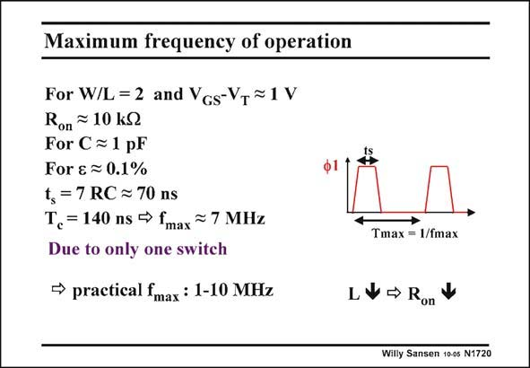

# SANSEN-1720 · Maximum frequency of operation

章节：17 开关电容滤波器  
PDF 页：484；书本页：494；幻灯片编号：1720  
状态：unreviewed



## 对应教材讲解

### PDF 484 · 书本 494

The maximum clock frequency also sets the maximum signal frequency, as the clock frequency must always be much larger than the signal frequency. The error which occurs when the clock frequency is not sufficiently large, will be calculated later. We now need to know on what maximum clock frequencies can be achieved. A small switch is taken with a R of 10 kV. The on capacitor is 1 pF. For an error of 0.1% the settling time is 70 ns and minimum period 140 ns. This corresponds to a clock frequency f of 7 MHz. max As a consequence, if we need higher clocks than about 10 MHz, the switches must have to be

### PDF 485 · 书本 495

made larger (larger W/L) or the capacitor smaller. Minimum unit capacitors are about 0.2 pF. However, if some gain is required, the other capacitor will be larger. Larger switches store more charge and will give rise to other side effects, which will be discussed later. It can be concluded that switched-capacitor filters do not easily work which clocks beyond a few tens of MHz.

## 公式／性能结论候选摘录

以下为规则截取的原文，尚未逐项判读。

- PDF 485: However, if some gain is required, the other capacitor will be larger.

## 曲线结论候选摘录

以下为规则截取的原文，尚未逐项判读。

（未由规则找到；不代表原页没有此类内容。）

## 原文条件与近似候选摘录

以下为规则截取的原文，尚未逐项判读。

- PDF 484: The maximum clock frequency also sets the maximum signal frequency, as the clock frequency must always be much larger than the signal frequency.

## 幻灯片 OCR（未校正）

```text
Maximum frequency of operation
For W/L = 2 and VGs-Vy~ 1 V
Ron ~ 10 kl
For C=1 pF
For & = 0.1%
ts = 7RC ≥ 70 ns
T, =140 ns → fmax ~ 7 MHz
Due to only one switch
→ practical fmax : 1-10 MHz
Tmax = 1/fmax
L*→ Ron*
Willy Sansen 10-05 N1720
```

数学上下标、分数及正负号以原图为准。电路图已保留；未核对的连接不输出成可仿真 netlist。
