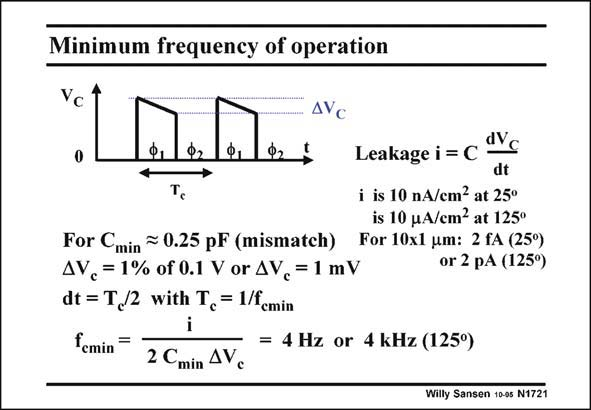

# SANSEN-1721 · Minimum frequency of operation

章节：17 开关电容滤波器  
PDF 页：485；书本页：495；幻灯片编号：1721  
状态：unreviewed



## 对应教材讲解

### PDF 485 · 书本 495

There is also a minimum frequency of operation. MOST Sources and Drains form junctions with respect to the substrate (or well). They leak. At room temperature these leakage currents are small but they increase drastically at higher temperatures. Remember that nowadays the Gate leaks as well, but this is left beyond consideration! As a result, the charge stored on a capacitor slowly disappears. The voltage slowly decreases. It ‘‘droops’’. The droop rate dV /dt is given in this slide. C If a 100 mV signal amplitude is taken, which we can allow to droop by 1% or 1 mV. Then the maximum half period is about 2 dt. At room temperature the minimum clock frequency f cmin is then about 4 Hz. This increases to 4 kHz at 125°C. It will be difficult to realize switched-capacitor filters at very low frequencies, unless leakage can be better controlled or the temperature lowered!

## 公式／性能结论候选摘录

以下为规则截取的原文，尚未逐项判读。

- PDF 485: At room temperature these leakage currents are small but they increase drastically at higher temperatures.
- PDF 485: As a result, the charge stored on a capacitor slowly disappears.
- PDF 485: The voltage slowly decreases.
- PDF 485: This increases to 4 kHz at 125°C.

## 曲线结论候选摘录

以下为规则截取的原文，尚未逐项判读。

（未由规则找到；不代表原页没有此类内容。）

## 原文条件与近似候选摘录

以下为规则截取的原文，尚未逐项判读。

（未由规则找到；不代表原页没有此类内容。）

## 幻灯片 OCR（未校正）

```text
Minimum frequency of operation
Vc
0
4Vc
dVc
Leakage i = C
dt
i is 10 nA/cm? at 25°
is 10 uA/em? at 125°
For 10x1 um: 2 fA (25°)
or 2 pA (125°)
For Cmin ~ 0.25 pF (mismatch)
AVc = 1% of 0.1 V or 4V, = 1 mV
dt = T,/2 with T, = 1/femin
femin
-.
=
= 4 Hz or 4 kHz (125°)
2 Cmin AVc
Willy Sansen 10-a5 N1721
```

数学上下标、分数及正负号以原图为准。电路图已保留；未核对的连接不输出成可仿真 netlist。
