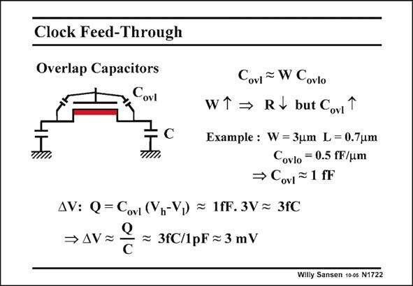

# SANSEN-1722 · Clock Feed-Through

章节：17 开关电容滤波器  
PDF 页：485；书本页：495；幻灯片编号：1722  
状态：unreviewed



## 对应教材讲解

### PDF 485 · 书本 495

Another problem with MOST switches is that the terminals are connected by parasitic capacitances. In a MOST they are the overlap capacitances. The larger the widths (for smaller R ), on the larger the overlap capacitors. The clock pulses are partially injected in the signal path. Indeed, the overlap capacitor C forms a ovl capacitive divider with the storage capacitor C. if C is about 1 fF and ovl

### PDF 486 · 书本 496

C is 1 pF, then about 0.1% of the clock pulse is injected in the signal path. For a clock of 3 V, this is a 3 mV error signal in the signal path. This gives a contribution at the clock frequency and its harmonics! It does not affect the lower frequency bands, however. The charge itself, transferred by C , is of the order of fC. It is quite small but not negligible. ovl

## 公式／性能结论候选摘录

以下为规则截取的原文，尚未逐项判读。

（未由规则找到；不代表原页没有此类内容。）

## 曲线结论候选摘录

以下为规则截取的原文，尚未逐项判读。

（未由规则找到；不代表原页没有此类内容。）

## 原文条件与近似候选摘录

以下为规则截取的原文，尚未逐项判读。

（未由规则找到；不代表原页没有此类内容。）

## 幻灯片 OCR（未校正）

```text
Clock Feed-Through
Overlap Capacitors
Covl
Covl = W Covlo
WT → Rv but Cov
Example : W =3um L= 0.7um
Covlo = 0.5 fF/um
→ Covi ~1 fF
ДV: Q = Covi (Vn-V,) = 1fF. 3V= 3fC
→ AV=
= 3fC/1pF ≥ 3 mV
C
Willy Sansen 10-05 N1722
```

数学上下标、分数及正负号以原图为准。电路图已保留；未核对的连接不输出成可仿真 netlist。
