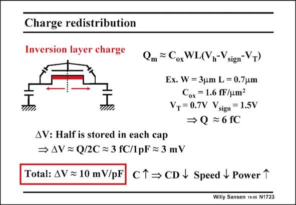

# SANSEN-1723 · Charge redistribution

章节：17 开关电容滤波器  
PDF 页：486；书本页：496；幻灯片编号：1723  
状态：unreviewed



## 对应教材讲解

### PDF 486 · 书本 496

Moreover, a MOST, which is switched on, contains a mobile charge Q in the m channel (inversion layer), which disappears when the MOST is switched off. The charge is redistributed towards both ends. This charge disappears towards the Source side and towards the Drain side depending on the relative impedances seen. If the capacitances on both sides are the same, then half the charge goes left and half right. A first-order calculation shows that this charge is also of the order of magnitude of fC. For a 1 pF storage capacitor, it also causes mV’s error. This error depends on the signal and causes distortion. A rule of thumb says that per pF storage capacitor, about 10 mV error can be expected as a result of clock injection and charge redistribution. This is a lot. Let us see what circuit techniques can be used to reduce these errors. Making everything fully differential is certainly one way to reduce these errors.

## 公式／性能结论候选摘录

以下为规则截取的原文，尚未逐项判读。

- PDF 486: This charge disappears towards the Source side and towards the Drain side depending on the relative impedances seen.
- PDF 486: This error depends on the signal and causes distortion.
- PDF 486: A rule of thumb says that per pF storage capacitor, about 10 mV error can be expected as a result of clock injection and charge redistribution.

## 曲线结论候选摘录

以下为规则截取的原文，尚未逐项判读。

（未由规则找到；不代表原页没有此类内容。）

## 原文条件与近似候选摘录

以下为规则截取的原文，尚未逐项判读。

（未由规则找到；不代表原页没有此类内容。）

## 幻灯片 OCR（未校正）

```text
Charge redistribution
Inversion layer charge
Qm ~ Cox WL(Vn-V
sign-VT)
Ex. W = 3um L = 0.7um
Cox = 1.6 fF/um?
Vr= 0.7V Vsign = 1.5V
→ Q =6fC
AV: Half is stored in each cap
→ AV = Q/2C = 3 fC/1pF ≥ 3 mV
Total: AV = 10 mV/pF
CT→ CD / Speed V Power 1
Willy Sansen 10-05 N1723
```

数学上下标、分数及正负号以原图为准。电路图已保留；未核对的连接不输出成可仿真 netlist。
