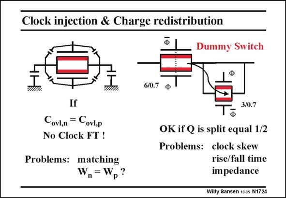

# SANSEN-1724 · Clock injection & Charge redistribution

章节：17 开关电容滤波器  
PDF 页：486；书本页：496；幻灯片编号：1724  
状态：unreviewed



## 对应教材讲解

### PDF 486 · 书本 496

Using a double switch is a possible remedy for clock injection (see left). When the nMOST receives a positively going clock pulse at its Gate, the pMOST receives a negatively going clock pulse at its Gate. The effects can cancel, provided the overlap capacitances match. Charge redistribution is reduced as well as the electrons of the nMOS recombining with the holes of the pMOST. The addition of a dummy

### PDF 487 · 书本 497

switch with specific dimensions (W/L) can help as well (see right). When the nMOST in the signal patch is switched out, its charge is taken up by the dummy nMOST switch, which is switched in. It is only half the size because we assume that the capacitances on both ends are the same. The same applies to the charge of the pMOSTs. Clock skew (delay in time) and different rise and fall times may render the charge compensation incomplete but these are only second-order effects. The main difficulty with the dummy switch is that the relative impedances (capacitors) must be known on both ends. If not, addition of a dummy switch may make things worse! Let us have a closer look at this compensation technique.

## 公式／性能结论候选摘录

以下为规则截取的原文，尚未逐项判读。

（未由规则找到；不代表原页没有此类内容。）

## 曲线结论候选摘录

以下为规则截取的原文，尚未逐项判读。

（未由规则找到；不代表原页没有此类内容。）

## 原文条件与近似候选摘录

以下为规则截取的原文，尚未逐项判读。

- PDF 486: The effects can cancel, provided the overlap capacitances match.
- PDF 487: It is only half the size because we assume that the capacitances on both ends are the same.

## 幻灯片 OCR（未校正）

```text
Clock injection & Charge redistribution
Dummy Switch
6/0.7
Ф
If
Covl,n = Covl,p
No Clock FT !
Problems: matching
W,=W,?
3/0.7
OK if Q is split equal 1/2
Problems: clock skew
rise/fall time
impedance
Willy Sansen 100s N1724
```

数学上下标、分数及正负号以原图为准。电路图已保留；未核对的连接不输出成可仿真 netlist。
