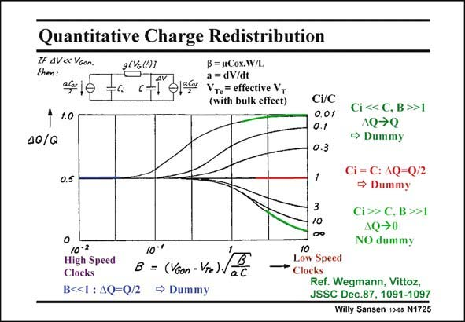

# SANSEN-1725 · Quantitative Charge Redistribution IF AV« VGon. B = 1Cox.W/L

章节：17 开关电容滤波器  
PDF 页：487；书本页：497；幻灯片编号：1725  
状态：unreviewed



## 对应教材讲解

### PDF 487 · 书本 497

This graph shows what fraction of the charge DQ/Q charge goes left and right, when a MOST switch is switched out. The capacitance at the input is C and i at the output C. On the horizontal axis, a parameter is used which includes the steepness of the clock pulses or simply the clock speed. It is normalized by means of some transistor parameters. High speed clocks are on the left, whereas slow clocks are on the right. It shows that for high-speed clocks (small B), the charge redistribution is always the same at both ends. Half of the charge goes left, and half right, irrespective of what the input and output capacitors are. Dummies are therefore better used. The picture is very different if the clock has slow edges (B large). In this case, the charge has time to find out what the capacitances (impedances) are on both sides and obviously flows towards the highest capacitance (lowest impedance). For a large C /C ratio, all the charge flows to the output and dummies are required with i equally sized transistors. When C equals C, then half the charge flows to the output and a i dummy MOST is required of half the size. For a small C /C ratio, no charge flows to the output i and a dummy is better not to be used. In practice, however, the situation is not as clear cut. It is difficult then to find out the right size of the dummy.

## 公式／性能结论候选摘录

以下为规则截取的原文，尚未逐项判读。

- PDF 487: Dummies are therefore better used.
- PDF 487: For a large C /C ratio, all the charge flows to the output and dummies are required with i equally sized transistors.
- PDF 487: When C equals C, then half the charge flows to the output and a i dummy MOST is required of half the size.

## 曲线结论候选摘录

以下为规则截取的原文，尚未逐项判读。

- PDF 487: On the horizontal axis, a parameter is used which includes the steepness of the clock pulses or simply the clock speed.

## 原文条件与近似候选摘录

以下为规则截取的原文，尚未逐项判读。

（未由规则找到；不代表原页没有此类内容。）

## 幻灯片 OCR（未校正）

```text
Quantitative Charge Redistribution
IF AV« VGon.
9(%(!)]
B = 1Cox.W/L
then:
a = dV/dt
af lo
VTe = effective V,
(with bulk effect)
1 1.0
40/Q
0.5
Ci/C
0.01
0.1
0.3
1
3
10
Ci << C, В >>1
1Q→Q
→ Dummy
Ci = C: 4Q=Q/2
→ Dummy
Ci >> C. В >>1
AQ→0
NO dummy
10-2
10-'
High Speed
Clocks
B = (VGon - Vre)V
aC
B<<1 : AQ=Q/2 • Dummy
10
Low Speed
Clocks
Ref. Wegmann, Vittoz,
JSSC Dec.87, 1091-1097
Willy Sansen 10-05 N1725
```

数学上下标、分数及正负号以原图为准。电路图已保留；未核对的连接不输出成可仿真 netlist。
