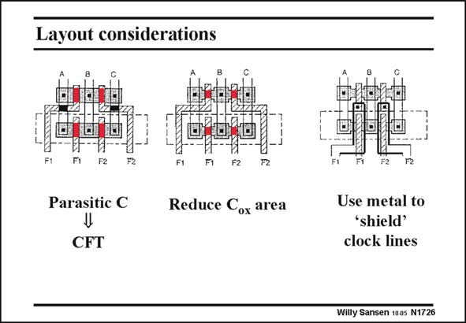

# SANSEN-1726 · Layout considerations

章节：17 开关电容滤波器  
PDF 页：488；书本页：498；幻灯片编号：1726  
状态：unreviewed



## 对应教材讲解

### PDF 487 · 书本 497

It has become clear from the above discussion that overlap capacitances must be as small as possible. On top of that, some more parasitic capacitances have to be added. For example, in the layout on the left, the poly Gate lines cross the Source and Drain lines. The crossing areas (black) give coupling capacitances to be added to the overlap capacitances.

### PDF 488 · 书本 498

The clock feedthrough will now be increased. Such layout is thus better avoided. The best that can be achieved is to use as small a MOST switch as possible, as shown in the middle. The overlap capacitances are also as small as possible as they scale with the widths of the MOSTs. On the right, an example is given on the use of metal shields between the clock lines and the actual MOSTs, reducing the coupling capacitances.

## 公式／性能结论候选摘录

以下为规则截取的原文，尚未逐项判读。

- PDF 488: The clock feedthrough will now be increased.
- PDF 488: Such layout is thus better avoided.

## 曲线结论候选摘录

以下为规则截取的原文，尚未逐项判读。

（未由规则找到；不代表原页没有此类内容。）

## 原文条件与近似候选摘录

以下为规则截取的原文，尚未逐项判读。

（未由规则找到；不代表原页没有此类内容。）

## 幻灯片 OCR（未校正）

```text
Layout considerations
F1
F1
F2
F2
F1
F2
P2
Parasitic C
Reduce Cox area
CFT
Use metal to
"shield'
clock lines
Willy Sansen 100s N1726
```

数学上下标、分数及正负号以原图为准。电路图已保留；未核对的连接不输出成可仿真 netlist。
