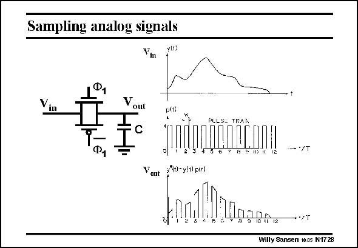

# SANSEN-1728 · Sampling analog signals

章节：17 开关电容滤波器  
PDF 页：489；书本页：499；幻灯片编号：1728  
状态：unreviewed



## 对应教材讲解

### PDF 489 · 书本 499

An analog signal is continuous in amplitude and in time (on top). When it is switched in and out at the rate of a clock frequency f c (represented by a pulse train in the middle), it becomes discontinuous in time (at the bottom). It is only available when the clock is high. It is a sampled analog signal. These signals are shown versus time. As Fourier has explained, they have an equivalent representation versus frequency, as shown next.

## 公式／性能结论候选摘录

以下为规则截取的原文，尚未逐项判读。

（未由规则找到；不代表原页没有此类内容。）

## 曲线结论候选摘录

以下为规则截取的原文，尚未逐项判读。

（未由规则找到；不代表原页没有此类内容。）

## 原文条件与近似候选摘录

以下为规则截取的原文，尚未逐项判读。

（未由规则找到；不代表原页没有此类内容。）

## 幻灯片 OCR（未校正）

```text
Sampling analog signals
Ф.
Vout
PULS- TRAN
ПППОШАП
$191
Yont *-y()pi+)
1110203900
- */T
+•/T
Willy Sansen 1005 N1728
```

数学上下标、分数及正负号以原图为准。电路图已保留；未核对的连接不输出成可仿真 netlist。
