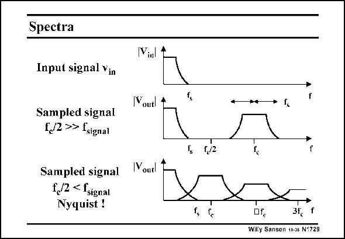

# SANSEN-1729 · Slide 1729

章节：17 开关电容滤波器  
PDF 页：489；书本页：499；幻灯片编号：1729  
状态：unreviewed



## 对应教材讲解

### PDF 489 · 书本 499

The bandwidth of the analog signal is limited. Its spectral content is limited to f . s When this signal is sampled by clock frequency f , it is actually multiplied c by this clock frequency. Its spectrum appears as two sidebands on both sides of the clock frequency, as shown in the middle. Note that the signal bands appear on all the harmonics of the clock frequency. Care has to be taken that the frequency bands do not overlap. This is called aliasing. To avoid overlap, the signal frequency f must be smaller than half the clock frequency f . This is called s c the Nyquist criterion. When the signal bandwidth f is too large, aliasing occurs (at the bottom), the information in s the overlap frequency band does not know to which band it belongs. It is lost. Aliasing must be avoided at all cost. To achieve this, a low-pass filter is applied before sampling. This filter is normally a passive filter. It is called an anti-aliasing filter.

## 公式／性能结论候选摘录

以下为规则截取的原文，尚未逐项判读。

- PDF 489: The bandwidth of the analog signal is limited.
- PDF 489: Its spectral content is limited to f . s When this signal is sampled by clock frequency f , it is actually multiplied c by this clock frequency.
- PDF 489: When the signal bandwidth f is too large, aliasing occurs (at the bottom), the information in s the overlap frequency band does not know to which band it belongs.

## 曲线结论候选摘录

以下为规则截取的原文，尚未逐项判读。

（未由规则找到；不代表原页没有此类内容。）

## 原文条件与近似候选摘录

以下为规则截取的原文，尚未逐项判读。

（未由规则找到；不代表原页没有此类内容。）

## 幻灯片 OCR（未校正）

```text
Spectra
Input signal vin
Sampled signal
(,/2 >> fsignal
Sampled signal
f,/2 < fsignal
Nyquist !
V.
Youtl
(Youtl
of,
3t.
Willy Sansen 10-35 N1729
```

数学上下标、分数及正负号以原图为准。电路图已保留；未核对的连接不输出成可仿真 netlist。
