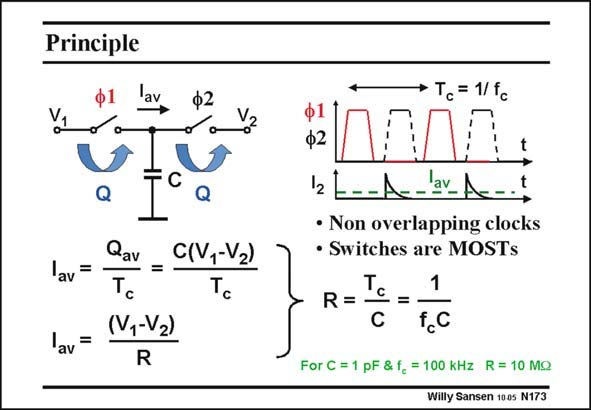

# SANSEN-173 · Principle

章节：17 开关电容滤波器  
PDF 页：476；书本页：486；幻灯片编号：173  
状态：unreviewed



## 对应教材讲解

### PDF 476 · 书本 486

Switching a capacitor in and out at the rate of a highfrequency clock passes a charge, which is peaked. Indeed, a clock is taken with frequency f , which has c two non-overlapping phases W1 and W2, which are both somewhat smaller than half the period T . c Charging capacitor C to voltage V during phase W1 1 and discharging capacitor C to voltage V during 2 phase W2, passes a charge C(V −V ) from the input 1 2 to the output terminal during period T . c The current which flows out of the output terminal is peaked, as it only flows at the beginning of phase W2. Its average however, I , can be regarded as an average current flowing from the av input to the output terminal, as a result of the voltage difference V −V . It can be regarded as 1 2 a current flowing between a voltage V −V because of a resistor R. 1 2 A switched capacitor now behaves as a resistor, provided averages are taken. This is true for low frequencies which are very low compared to the clock frequency. The equivalent resistance R is 1/f C. It can be increased in size for small values of clock c frequency and capacitor. For 100 kHz and 1 pF we already find a resistance of 10 MV, a value which is impossible to integrate otherwise.

## 公式／性能结论候选摘录

以下为规则截取的原文，尚未逐项判读。

- PDF 476: Its average however, I , can be regarded as an average current flowing from the av input to the output terminal, as a result of the voltage difference V −V .
- PDF 476: It can be increased in size for small values of clock c frequency and capacitor.

## 曲线结论候选摘录

以下为规则截取的原文，尚未逐项判读。

- PDF 476: Switching a capacitor in and out at the rate of a highfrequency clock passes a charge, which is peaked.
- PDF 476: Indeed, a clock is taken with frequency f , which has c two non-overlapping phases W1 and W2, which are both somewhat smaller than half the period T . c Charging capacitor C to voltage V during phase W1 1 and discharging capacitor C to voltage V during 2 phase W2, passes a charge C(V −V ) from the input 1 2 to the output terminal during period T . c The current which flows out of the output terminal is peaked, as it only flows at the beginning of phase W2.

## 原文条件与近似候选摘录

以下为规则截取的原文，尚未逐项判读。

- PDF 476: It can be regarded as 1 2 a current flowing between a voltage V −V because of a resistor R. 1 2 A switched capacitor now behaves as a resistor, provided averages are taken.

## 幻灯片 OCR（未校正）

```text
Principle
av
Ф2
av=
lav=
Q
Qav
C(V,-Vz)
=
Tc
(V,-Vz)
R
Tc = 1/fc
ф2
12 -
A.
av_ A
• Non overlapping clocks
• Switches are MOSTs
T
1
R =
=
f.C
For C = 1 pF & f, = 100 kHz R= 10 MQ
Willy Sansen 100s N173
```

数学上下标、分数及正负号以原图为准。电路图已保留；未核对的连接不输出成可仿真 netlist。
