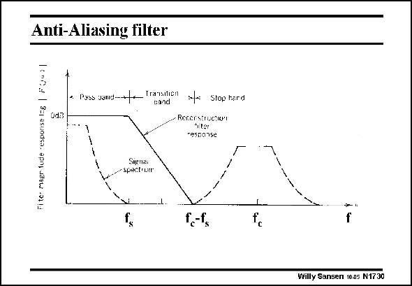

# SANSEN-1730 · Anti-Aliasing filter

章节：17 开关电容滤波器  
PDF 页：490；书本页：500；幻灯片编号：1730  
状态：unreviewed



## 对应教材讲解

### PDF 490 · 书本 500

To avoid aliasing, an antialiasing filter is required with a low-pass characteristic to make sure that no high-frequency content is present in the input signal beyond f /2. c Some distance must be kept between f and f −f so s c s that a first or second-order filter is sufficient. Steep filters require many components and are difficult to match. Remember, that passive filters are usually used to avoid distortion. Higherorder anti-aliasing filters are to be avoided.

## 公式／性能结论候选摘录

以下为规则截取的原文，尚未逐项判读。

（未由规则找到；不代表原页没有此类内容。）

## 曲线结论候选摘录

以下为规则截取的原文，尚未逐项判读。

- PDF 490: To avoid aliasing, an antialiasing filter is required with a low-pass characteristic to make sure that no high-frequency content is present in the input signal beyond f /2. c Some distance must be kept between f and f −f so s c s that a first or second-order filter is sufficient.

## 原文条件与近似候选摘录

以下为规则截取的原文，尚未逐项判读。

（未由规则找到；不代表原页没有此类内容。）

## 幻灯片 OCR（未校正）

```text
Anti-Aliasing filter
H ut3
• Poss sand--ae Tranaticn ale Stophard
nand
.Recerstnuetion
Siter
cesponse
Signa:
espectror
r,-fs
Willy Sansen 10.05 N1730
```

数学上下标、分数及正负号以原图为准。电路图已保留；未核对的连接不输出成可仿真 netlist。
