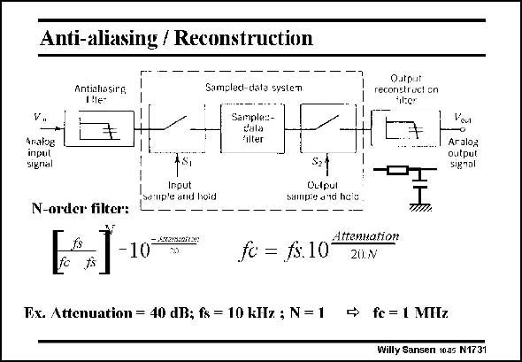

# SANSEN-1731 · Anti-aliasing / Reconstruction

章节：17 开关电容滤波器  
PDF 页：490；书本页：500；幻灯片编号：1731  
状态：unreviewed



## 对应教材讲解

### PDF 490 · 书本 500

The order of the filter and the amount of attenuation are related as given in this slide. Normally, a first-order filter (N=1) is preferred. Such a sampled filter has therefore the following building blocks. The analog signal is applied to a antialiasing filter. It is sampled by switches. A sampled-data filter is applied, which has the advantage that no external components are required. A clock is necessary, however. The output signal is then applied to a sample-and-hold circuit, to make it continuous in time. Another low-pass filter is then applied to filter out the clock frequency. It is called a reconstruction filter. A pure analog signal results. The same expressions are valid. Nowadays, the input signal is filtered and kept in sampled form to be applied to a Analogto-digital converter, and then eventually to a DSP block. After all this signal processing, it is applied to a Digital-to-analog converter, the last block of which is a reconstruction low-pass filter.

## 公式／性能结论候选摘录

以下为规则截取的原文，尚未逐项判读。

- PDF 490: Such a sampled filter has therefore the following building blocks.

## 曲线结论候选摘录

以下为规则截取的原文，尚未逐项判读。

（未由规则找到；不代表原页没有此类内容。）

## 原文条件与近似候选摘录

以下为规则截取的原文，尚未逐项判读。

（未由规则找到；不代表原页没有此类内容。）

## 幻灯片 OCR（未校正）

```text
Anti-aliasing / Reconstruction
Antialasing
1Me-
Vn
Analog
inpul
signal
Sampled-date system
Sample:-
dala
filter
Qutput
reconstruct on
tilter
Vou
Aralog
Output
Signal
N-order filter:
AS,
Input
sdlup'e and hoid
Oulput
bampie did hels
-10
fc = fs:10
Attennarion
20
Ex. Attenuation = 40 dB; fs = 10 kHz ; N = 1 → fe = 1 MHz
Willy Sansen 1005 N1731
```

数学上下标、分数及正负号以原图为准。电路图已保留；未核对的连接不输出成可仿真 netlist。
