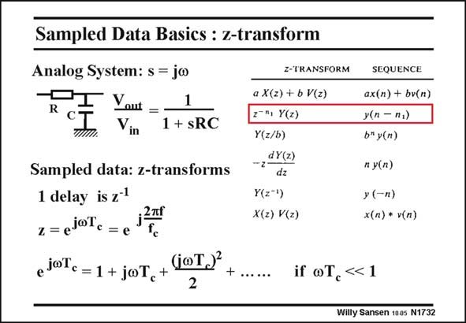

# SANSEN-1732 · Sampled Data Basics : z-transform

章节：17 开关电容滤波器  
PDF 页：491；书本页：501；幻灯片编号：1732  
状态：unreviewed



## 对应教材讲解

### PDF 491 · 书本 501

In analog systems, the signals are best represented by their Laplace transforms with variable s which is the complex frequency jv. The best way to describe transfer functions is the use of the Laplace transform. An example is given of a firstorder low-pass filter with time constant RC. It is easy to transform this expression back to frequency by simple substitution of s by jv. In sampled data systems, the signals are best represented by their z-transforms. Indeed the only accurate way to describe transfer functions is the use of z-transforms. A delay of one single clock pulse then corresponds to a multiplication by z−1. A few elementary characteristics of z-transforms are given in this slide. It is easy to transform an expression in z back to frequency by substitution of z by exp( jvT ) c or exp(2pjf/f ). Since the signal frequency f is much smaller than the clock frequency f , this c c exponential can be developed into a power series, as shown in this slide. It is sufficient to keep the first few terms.

## 公式／性能结论候选摘录

以下为规则截取的原文，尚未逐项判读。

（未由规则找到；不代表原页没有此类内容。）

## 曲线结论候选摘录

以下为规则截取的原文，尚未逐项判读。

- PDF 491: A few elementary characteristics of z-transforms are given in this slide.

## 原文条件与近似候选摘录

以下为规则截取的原文，尚未逐项判读。

- PDF 491: Since the signal frequency f is much smaller than the clock frequency f , this c c exponential can be developed into a power series, as shown in this slide.

## 幻灯片 OCR（未校正）

```text
Sampled Data Basics : z-transform
Analog System: s = jo
Yaut = -
1
Vin
1 + sRC
Sampled data: z-transforms
1 delay is z'
.2ml
z=ejoTe=e'
ejaT. =1 + joT, + GoTJ?
Z-TRANSFORM
a X(z) + b V(z)
2Ry Y(z)
Y(z/b)
-,dY(2)
dz
Y(2*1)
X(z) V(z)
SEQUENCE
ax(n) + bv(n)
y(n - n,)
b™ y(n)
n y(п)
y (-п)
x(п) + v(n)
if oT, <1
Willy Sansen 1005 N1732
```

数学上下标、分数及正负号以原图为准。电路图已保留；未核对的连接不输出成可仿真 netlist。
