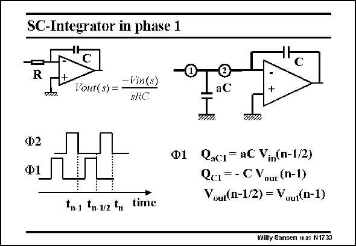

# SANSEN-1733 · SC-Integrator in phase 1

章节：17 开关电容滤波器  
PDF 页：491；书本页：501；幻灯片编号：1733  
状态：unreviewed



## 对应教材讲解

### PDF 491 · 书本 501

In order to find the transfer characteristic of a sampleddata filter in z, charge conservation is used. There are other more formal techniques (see Laker-Sansen, McGrawHill 1994), but charge conservation is the easiest one, although it may not always work. An example is given of a simple integrator. An analog integrator has a transfer characteristic, which is well known, as shown on the top left. What is now the transfer characteristic of the sampled-data inverter shown on top right? The resistor has been substituted by its sampled-data equivalent and called aC. In order to find the transfer characteristic in z, charge conservation is applied. This means that we add up the charges on the capacitors in phase 1, and equate it to the charges in phase 2. Indeed, charges cannot disappear as currents cannot disappear (laws of Kirchoff ).

### PDF 492 · 书本 502

For this purpose, a clock pulse of phase 2 is considered at time t . Note also,this time actually n corresponds to the end of the clock pulse, when all charge has been fully transferred. One period earlier, the clock pulse of phase 2 occurs at t . The other phase (phase 1) then occurs at t n−1 n−1/2 at the end. The charge on capacitance aC during phase 1 is denoted by Q and is given in this slide. It aC1 is available at time t . The charge on capacitor C is given by Q As switch 2 is open during n−1/2 C1. phase 1, we can as well take this charge at time t as at time t . n−1/2 n−1

## 公式／性能结论候选摘录

以下为规则截取的原文，尚未逐项判读。

（未由规则找到；不代表原页没有此类内容。）

## 曲线结论候选摘录

以下为规则截取的原文，尚未逐项判读。

- PDF 491: In order to find the transfer characteristic of a sampleddata filter in z, charge conservation is used.
- PDF 491: An analog integrator has a transfer characteristic, which is well known, as shown on the top left.
- PDF 491: What is now the transfer characteristic of the sampled-data inverter shown on top right?
- PDF 491: In order to find the transfer characteristic in z, charge conservation is applied.
- PDF 491: This means that we add up the charges on the capacitors in phase 1, and equate it to the charges in phase 2.
- PDF 492: For this purpose, a clock pulse of phase 2 is considered at time t .
- PDF 492: One period earlier, the clock pulse of phase 2 occurs at t .
- PDF 492: The other phase (phase 1) then occurs at t n−1 n−1/2 at the end.

## 原文条件与近似候选摘录

以下为规则截取的原文，尚未逐项判读。

（未由规则找到；不代表原页没有此类内容。）

## 幻灯片 OCR（未校正）

```text
SC-Integrator in phase 1
-Vin(s)
Yout(s) =
SRC
Ф2
Ф1
Ф1
tn-1 tn-1/2 th
time
₴
aC
Qaci= aC Vmm(n-1/2)
Qc1=-CV
out (n-1)
Voui (n-1/2) = Vuu(n-1)
Willy Sansen 10.05 N1733
```

数学上下标、分数及正负号以原图为准。电路图已保留；未核对的连接不输出成可仿真 netlist。
