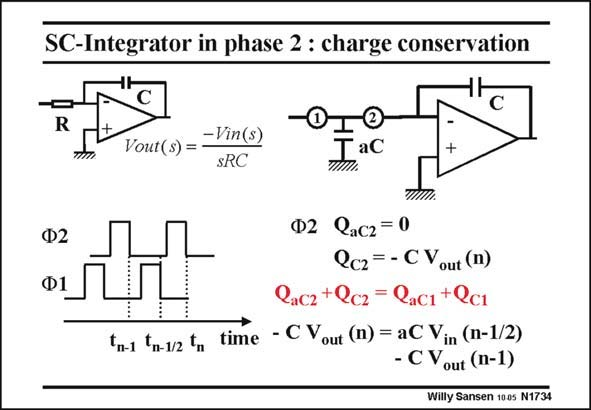

# SANSEN-1734 · SC-Integrator in phase 2 : charge conservation

章节：17 开关电容滤波器  
PDF 页：492；书本页：502；幻灯片编号：1734  
状态：unreviewed



## 对应教材讲解

### PDF 492 · 书本 502

When switch 2 is closed (on phase 2), capacitor aC is fully discharged as the minus input of the opamp goes to zero because of the feedback. The gain is assumed to be sufficiently high to reduce the differential input zero, whatever appears at the output. In this phase 2, the charge on capacitor ac C is zero and the charge on capacitor C changes to Q . C2 Noting that the sum of the charges in phase 1, equals the sum of the charges in phase 2, gives the charge conservation equation. Note that this equation links the output voltage to the input voltage. The voltages appear at different times, however. In this form, this equation cannot be solved.

## 公式／性能结论候选摘录

以下为规则截取的原文，尚未逐项判读。

- PDF 492: The gain is assumed to be sufficiently high to reduce the differential input zero, whatever appears at the output.
- PDF 492: C2 Noting that the sum of the charges in phase 1, equals the sum of the charges in phase 2, gives the charge conservation equation.

## 曲线结论候选摘录

以下为规则截取的原文，尚未逐项判读。

- PDF 492: When switch 2 is closed (on phase 2), capacitor aC is fully discharged as the minus input of the opamp goes to zero because of the feedback.
- PDF 492: In this phase 2, the charge on capacitor ac C is zero and the charge on capacitor C changes to Q .
- PDF 492: C2 Noting that the sum of the charges in phase 1, equals the sum of the charges in phase 2, gives the charge conservation equation.

## 原文条件与近似候选摘录

以下为规则截取的原文，尚未逐项判读。

- PDF 492: The gain is assumed to be sufficiently high to reduce the differential input zero, whatever appears at the output.

## 幻灯片 OCR（未校正）

```text
SC-Integrator in phase 2 : charge conservation
-Vin(s)
Vout(s) =
SRC
aC
Ф2
Ф1
Fn-1 Fn-1/2 tm
Ф2 QaCz= 0
Qcz= - CV
out (n)
Cacz +Qcz = Rac1+Qc1
time - C Vout (n) = aC Vin (n-1/2)
- C Vout (n-1)
Willy Sansen 1005 N1734
```

数学上下标、分数及正负号以原图为准。电路图已保留；未核对的连接不输出成可仿真 netlist。
