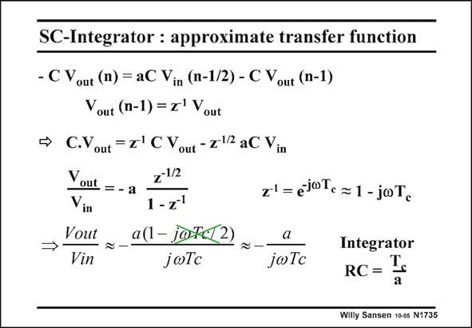

# SANSEN-1735 · SC-Integrator : approximate transfer function

章节：17 开关电容滤波器  
PDF 页：492；书本页：502；幻灯片编号：1735  
状态：unreviewed



## 对应教材讲解

### PDF 492 · 书本 502

The charge conservation equation is copied on top. All voltages are now converted into z-transforms. One delay corresponds to z−1. The gain V /V is now out in readily written. It shows that the gain equals a, the ratio of the two capacitors, multiplied by a factor in z. To see what this factor means in the frequency domain, z is substituted by exp( jvT ). For frequencies c much lower than the clock frequency f , this exponential can be developed into a power series, which can be cut off after jvT . c c

### PDF 493 · 书本 503

The resulting gain is exactly the same as for a purely analog integrator, provided the time constant T /a. c This is approximation however, for low frequencies. For higher frequencies, an error is made, discussed next.

## 公式／性能结论候选摘录

以下为规则截取的原文，尚未逐项判读。

- PDF 492: The gain V /V is now out in readily written.
- PDF 492: It shows that the gain equals a, the ratio of the two capacitors, multiplied by a factor in z.
- PDF 493: The resulting gain is exactly the same as for a purely analog integrator, provided the time constant T /a. c This is approximation however, for low frequencies.

## 曲线结论候选摘录

以下为规则截取的原文，尚未逐项判读。

（未由规则找到；不代表原页没有此类内容。）

## 原文条件与近似候选摘录

以下为规则截取的原文，尚未逐项判读。

- PDF 493: The resulting gain is exactly the same as for a purely analog integrator, provided the time constant T /a. c This is approximation however, for low frequencies.

## 幻灯片 OCR（未校正）

```text
SC-Integrator : approximate transfer function
- C Vout (n) = aC Vin (n-1/2) - C Vout (n-1)
Vout (n-1) = 7' Vout
→ C.Vout = E'C Vout -2l2 aC Vin
Vout = - a
z-1/2
Vin
1-7'
Vout
a(1- jaTc(2)
→
Vin
joTc
joTc
7=ejole=1-joTe
Integrator
RC = Ts
Willy Sansen 10-0s N1735
```

数学上下标、分数及正负号以原图为准。电路图已保留；未核对的连接不输出成可仿真 netlist。
