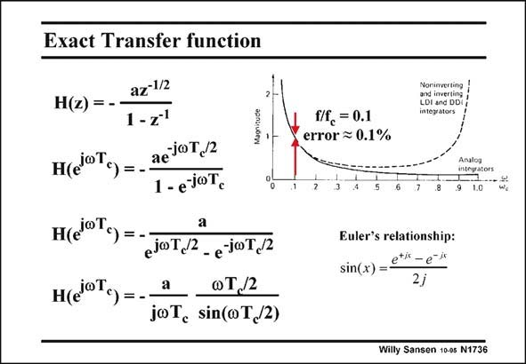

# SANSEN-1736 · Exact Transfer function

章节：17 开关电容滤波器  
PDF 页：493；书本页：503；幻灯片编号：1736  
状态：unreviewed



## 对应教材讲解

### PDF 493 · 书本 503

To find out what the transfer characteristic is for all frequencies, the original expression H(z) in z is taken again. The exponentials can be rewritten in terms of vT /2. c They can be combined in a sine function. The same expression of an integrator is obtained, but multiplied by a sin(x)/x function. This function is the error functional which is typical for all sampling of analog signals. This function is calculated on the next slide. A rule of thumb is that for a frequency one tenth of the clock frequency, the error is about one tenth of a percent. This error grows with the square of the frequency, as shown on the next slide.

## 公式／性能结论候选摘录

以下为规则截取的原文，尚未逐项判读。

（未由规则找到；不代表原页没有此类内容。）

## 曲线结论候选摘录

以下为规则截取的原文，尚未逐项判读。

- PDF 493: To find out what the transfer characteristic is for all frequencies, the original expression H(z) in z is taken again.

## 原文条件与近似候选摘录

以下为规则截取的原文，尚未逐项判读。

（未由规则找到；不代表原页没有此类内容。）

## 幻灯片 OCR（未校正）

```text
Exact Transfer function
H(z) =
H(oT.) =
az-1/2
1-Z'
aejOT,/2
1-ejoT.
Magnitude
H(i0T.) =
a
ejoT,/2
- e JOT,/2
н(i°T,) =-
o1.2
jcT, sin(oT,2)
Noninverting
LDL BNG DDY
integrators
f/f, = 0.1
error = 0.1%
Analog
integators
.9 1.0
Euler's relationship:
sin(x) = etii - e-it
2j
Willy Sansen 10-a5 N1736
```

数学上下标、分数及正负号以原图为准。电路图已保留；未核对的连接不输出成可仿真 netlist。
