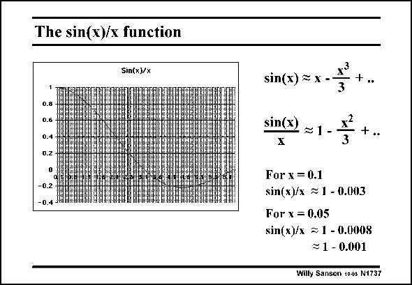

# SANSEN-1737 · The sin(x)/x function

章节：17 开关电容滤波器  
PDF 页：493；书本页：503；幻灯片编号：1737  
状态：unreviewed



## 对应教材讲解

### PDF 493 · 书本 503

The sin(x)/x function is easily calculated, as shown in this slide. It starts at 1 for small x and goes through zero at x=p=3.14. For small values of x, the sine function can be represented by a power series and cut off after the first two terms. For x=0.1, the function drops to 0.3% below unity. For x=0.05 as on the previous slide, the function drops to 0.08% below unity. This is taken to be about 0.1%. Note also that this function changes with x2. The errors decrease rapidly for smaller values of x. For example, for an error of 0.05% the value is about 0.04. An error of 0.05% is a typical

### PDF 494 · 书本 504

value used in the design of SC filters. It leads to dynamic ranges of about 70 dB, as will be shown later.

## 公式／性能结论候选摘录

以下为规则截取的原文，尚未逐项判读。

- PDF 493: The errors decrease rapidly for smaller values of x.

## 曲线结论候选摘录

以下为规则截取的原文，尚未逐项判读。

（未由规则找到；不代表原页没有此类内容。）

## 原文条件与近似候选摘录

以下为规则截取的原文，尚未逐项判读。

（未由规则找到；不代表原页没有此类内容。）

## 幻灯片 OCR（未校正）

```text
The sin(x)/x function
Sin(x)/x
sin(x) ~ x -•
0.8
0.6
0.4
0.Z
sin(x
1-
-0.2
For x = 0.1
sin(x)/x 1 - 0.003
For x = 0.05
sin(x)/x = 1 - 0.0008
= 1 - 0.001
Willy Sansen 100s N1737
```

数学上下标、分数及正负号以原图为准。电路图已保留；未核对的连接不输出成可仿真 netlist。
