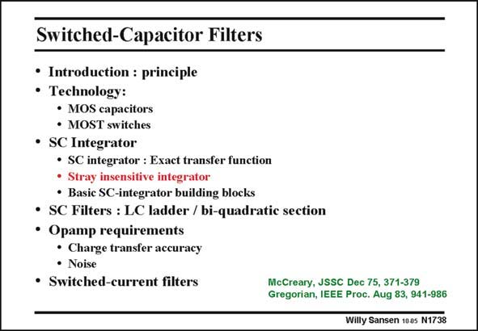

# SANSEN-1738 · Switched-Capacitor Filters

章节：17 开关电容滤波器  
PDF 页：494；书本页：504；幻灯片编号：1738  
状态：unreviewed



## 对应教材讲解

### PDF 494 · 书本 504

In this switched-capacitor realization of a resistor, parasitic capacitances play an important role. These capacitors cannot therefore be made small, which leads to excessive power consumption. This is why a stray-insensitive equivalent is better used. This is discussed next.

## 公式／性能结论候选摘录

以下为规则截取的原文，尚未逐项判读。

- PDF 494: These capacitors cannot therefore be made small, which leads to excessive power consumption.

## 曲线结论候选摘录

以下为规则截取的原文，尚未逐项判读。

（未由规则找到；不代表原页没有此类内容。）

## 原文条件与近似候选摘录

以下为规则截取的原文，尚未逐项判读。

（未由规则找到；不代表原页没有此类内容。）

## 幻灯片 OCR（未校正）

```text
Switched-Capacitor Filters
• Introduction : principle
• Technology:
• MOS capacitors
• MOST switches
• SC Integrator
• SC integrator : Exact transfer function
• Stray insensitive integrator
• Basic SC-integrator building blocks
• SC Filters : LC ladder / bi-quadratic section
• Opamp requirements
• Charge transfer accuracy
• Noise
• Switched-current filters
McCreary, JSSC Dec 75, 371-379
Gregorian, IEEE Proc. Aug 83, 941-986
Willy Sansen 100s N1738
```

数学上下标、分数及正负号以原图为准。电路图已保留；未核对的连接不输出成可仿真 netlist。
