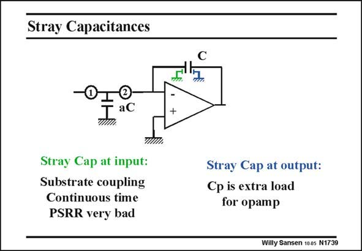

# SANSEN-1739 · Stray Capacitances

章节：17 开关电容滤波器  
PDF 页：494；书本页：504；幻灯片编号：1739  
状态：unreviewed



## 对应教材讲解

### PDF 494 · 书本 504

Each capacitor has a parasitic capacitor from the bottom plate to the underlying conductor (substrate, ...). For capacitor aC, this bottom plate is obviously connected to ground, where it is shorted out. For capacitor C however, it is not so clear. If the bottom plate is connected to the minus input of the opamp (green), then the minus node picks up substrate noise more easily, which is bad for the PSRR. If on the other hand, the bottom plate is connected to the output of the opamp (blue), then the load capacitance increases by this amount, increasing the power consumption. Yet, the latter solution is usually preferred.

## 公式／性能结论候选摘录

以下为规则截取的原文，尚未逐项判读。

- PDF 494: If on the other hand, the bottom plate is connected to the output of the opamp (blue), then the load capacitance increases by this amount, increasing the power consumption.

## 曲线结论候选摘录

以下为规则截取的原文，尚未逐项判读。

（未由规则找到；不代表原页没有此类内容。）

## 原文条件与近似候选摘录

以下为规则截取的原文，尚未逐项判读。

（未由规则找到；不代表原页没有此类内容。）

## 幻灯片 OCR（未校正）

```text
Stray Capacitances
I
aC
Stray Cap at input:
Substrate coupling
Continuous time
PSRR very bad
Stray Cap at output:
Cp is extra load
for opamp
Willy Sansen 100s N1739
```

数学上下标、分数及正负号以原图为准。电路图已保留；未核对的连接不输出成可仿真 netlist。
