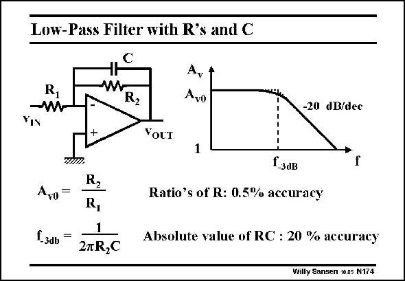

# SANSEN-174 · Low-Pass Filter with R's and C

章节：17 开关电容滤波器  
PDF 页：476；书本页：486；幻灯片编号：174  
状态：unreviewed



## 对应教材讲解

### PDF 476 · 书本 486

Take as an example, this low-pass filter. The low-frequency gain A is a ratio of v0 resistors, which can be made quite accurately. The cut-off frequency f however depends on a −3dB product of a resistor R and 2 the capacitor C. There is no way that this product R C 2 can be realized in an accurate way. Errors of more than 20% cannot be avoided. Substitution of this resistor R by its switched- 2 capacitor equivalent, will involve ratios only, which are easily realized with great accuracy.

## 公式／性能结论候选摘录

以下为规则截取的原文，尚未逐项判读。

- PDF 476: The low-frequency gain A is a ratio of v0 resistors, which can be made quite accurately.
- PDF 476: The cut-off frequency f however depends on a −3dB product of a resistor R and 2 the capacitor C.

## 曲线结论候选摘录

以下为规则截取的原文，尚未逐项判读。

（未由规则找到；不代表原页没有此类内容。）

## 原文条件与近似候选摘录

以下为规则截取的原文，尚未逐项判读。

（未由规则找到；不代表原页没有此类内容。）

## 幻灯片 OCR（未校正）

```text
Low-Pass Filter with R's and C
R
A,
Ayo
-20 dB/dec
+
Yост
1
Aro
f 30b
R2
R,
1
27R,C
t-зав
Ratio's of R: 0.5% accuracy
Absolute value of RC : 20 % accuracy
willy Sansen 10a5 N174
```

数学上下标、分数及正负号以原图为准。电路图已保留；未核对的连接不输出成可仿真 netlist。
