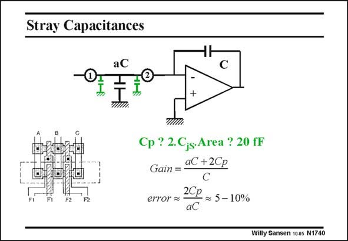

# SANSEN-1740 · Stray Capacitances

章节：17 开关电容滤波器  
PDF 页：495；书本页：505；幻灯片编号：1740  
状态：unreviewed



## 对应教材讲解

### PDF 495 · 书本 505

Moreover, the Source and Drain junction capacitances of the switches have to be added to capacitor aC. The Source capacitor of switch 1 and the Drain capacitor of switch 2 are shown in this slide (green). Together, they can easily give an error on aC of 5 to 10%. Remember that a Source junction capacitance is of the same order of magnitude as the C , which is about GS kW (with k#2 fF/mm) for minimum-L transistors. For a W#5 mm, such a Source junction capacitor is about 10 fF. A better alternative is to make capacitor aC floating, as shown next.

## 公式／性能结论候选摘录

以下为规则截取的原文，尚未逐项判读。

（未由规则找到；不代表原页没有此类内容。）

## 曲线结论候选摘录

以下为规则截取的原文，尚未逐项判读。

（未由规则找到；不代表原页没有此类内容。）

## 原文条件与近似候选摘录

以下为规则截取的原文，尚未逐项判读。

（未由规则找到；不代表原页没有此类内容。）

## 幻灯片 OCR（未校正）

```text
Stray Capacitances
aC
F2
Cp ? 2.Cjs-Area ? 20 fF
Gain =
aC +2Cp
error a
2CP ~ 5 - 10%
aC
Willy Sansen 100s N1740
```

数学上下标、分数及正负号以原图为准。电路图已保留；未核对的连接不输出成可仿真 netlist。
