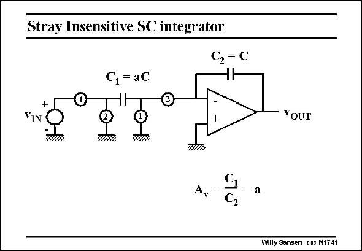

# SANSEN-1741 · Stray Insensitive SC integrator

章节：17 开关电容滤波器  
PDF 页：495；书本页：505；幻灯片编号：1741  
状态：unreviewed



## 对应教材讲解

### PDF 495 · 书本 505

Capacitor aC is now floating. Two more switches are necessary. However, the ratio a will be insensitive to the parasitic junction capacitances. Similar functions are carried out during the two phases. During phase 1, capacitor aC is charged to the input voltage. During phase 2, this capacitor aC is discharged to zero, forcing its charge towards C. Let us now see how the parasitic junction capacitances of all four switches come in. If they do not, the gain A is accurately equal to a. v The operation of this SC integrator is illustrated even better by showing the circuit first with the clocks closed on phase 1, and then on 2.

## 公式／性能结论候选摘录

以下为规则截取的原文，尚未逐项判读。

- PDF 495: If they do not, the gain A is accurately equal to a. v The operation of this SC integrator is illustrated even better by showing the circuit first with the clocks closed on phase 1, and then on 2.

## 曲线结论候选摘录

以下为规则截取的原文，尚未逐项判读。

- PDF 495: During phase 1, capacitor aC is charged to the input voltage.
- PDF 495: During phase 2, this capacitor aC is discharged to zero, forcing its charge towards C.
- PDF 495: If they do not, the gain A is accurately equal to a. v The operation of this SC integrator is illustrated even better by showing the circuit first with the clocks closed on phase 1, and then on 2.

## 原文条件与近似候选摘录

以下为规则截取的原文，尚未逐项判读。

（未由规则找到；不代表原页没有此类内容。）

## 幻灯片 OCR（未校正）

```text
Stray Insensitive SC integrator
C, = C
C,= aC
IN
Your
9
A,=
= а
willy Sansen 1005 N1741
```

数学上下标、分数及正负号以原图为准。电路图已保留；未核对的连接不输出成可仿真 netlist。
