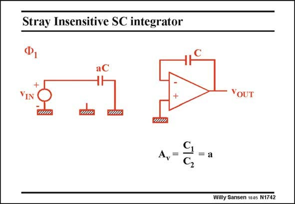

# SANSEN-1742 · Stray Insensitive SC integrator

章节：17 开关电容滤波器  
PDF 页：496；书本页：506；幻灯片编号：1742  
状态：unreviewed



## 对应教材讲解

### PDF 496 · 书本 506

Note that in phase 1, the left side of capacitor aC is charged positively. Its right side is negative. During phase 2 it will be applied to an inverting amplifier configuration. We will therefore have a non-inverting integrator.

## 公式／性能结论候选摘录

以下为规则截取的原文，尚未逐项判读。

- PDF 496: We will therefore have a non-inverting integrator.

## 曲线结论候选摘录

以下为规则截取的原文，尚未逐项判读。

- PDF 496: Note that in phase 1, the left side of capacitor aC is charged positively.
- PDF 496: During phase 2 it will be applied to an inverting amplifier configuration.

## 原文条件与近似候选摘录

以下为规则截取的原文，尚未逐项判读。

（未由规则找到；不代表原页没有此类内容。）

## 幻灯片 OCR（未校正）

```text
Stray Insensitive SC integrator
aC
+
A, =
YOUT
= a
Willy Sansen 1005 N1742
```

数学上下标、分数及正负号以原图为准。电路图已保留；未核对的连接不输出成可仿真 netlist。
