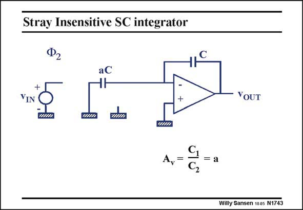

# SANSEN-1743 · Stray Insensitive SC integrator

章节：17 开关电容滤波器  
PDF 页：496；书本页：506；幻灯片编号：1743  
状态：unreviewed



## 对应教材讲解

### PDF 496 · 书本 506

In phase 2, the voltage across aC is applied to the inverting amplifier, generating the voltage gain of a. Capacitor aC is now fully discharged provided the gain of the opamp is sufficiently high and no offset is present.

## 公式／性能结论候选摘录

以下为规则截取的原文，尚未逐项判读。

- PDF 496: In phase 2, the voltage across aC is applied to the inverting amplifier, generating the voltage gain of a.
- PDF 496: Capacitor aC is now fully discharged provided the gain of the opamp is sufficiently high and no offset is present.

## 曲线结论候选摘录

以下为规则截取的原文，尚未逐项判读。

- PDF 496: In phase 2, the voltage across aC is applied to the inverting amplifier, generating the voltage gain of a.

## 原文条件与近似候选摘录

以下为规则截取的原文，尚未逐项判读。

- PDF 496: Capacitor aC is now fully discharged provided the gain of the opamp is sufficiently high and no offset is present.

## 幻灯片 OCR（未校正）

```text
Stray Insensitive SC integrator
Ф2
aC
HH
YIN
= а
С,
YOUT
Willy Sansen 1005 N1743
```

数学上下标、分数及正负号以原图为准。电路图已保留；未核对的连接不输出成可仿真 netlist。
