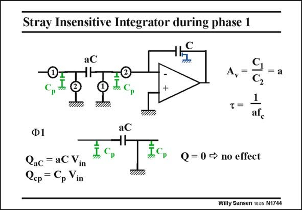

# SANSEN-1744 · Stray Insensitive Integrator during phase 1

章节：17 开关电容滤波器  
PDF 页：497；书本页：507；幻灯片编号：1744  
状态：unreviewed



## 对应教材讲解

### PDF 496 · 书本 506

Let us now see how the parasitic junction capacitances of all four switches come in. The full integrator is shown on top, with the parasitic capacitances C . p The situation is depicted during clock phase 1. The opamp is not connected and is now left out. The parasitic capacitor C on the left of aC is driven by the output of the previous stage. It p is a low-impedance point which easily charge this capacitor without affecting the voltage across aC. As a result, it does not affect charge Q . aC

### PDF 497 · 书本 507

The parasitic capacitor C p on the right of aC is shunted to ground. As a result, it does not affect charge Q aC either. The parasitic capacitances have no influence on the charge on capacitor aC. This latter capacitance aC can therefore be smaller without loosing accuracy. Typical values are 0.2 to 0.25 pF.

## 公式／性能结论候选摘录

以下为规则截取的原文，尚未逐项判读。

- PDF 496: As a result, it does not affect charge Q . aC
- PDF 497: As a result, it does not affect charge Q aC either.
- PDF 497: This latter capacitance aC can therefore be smaller without loosing accuracy.

## 曲线结论候选摘录

以下为规则截取的原文，尚未逐项判读。

- PDF 496: The full integrator is shown on top, with the parasitic capacitances C . p The situation is depicted during clock phase 1.

## 原文条件与近似候选摘录

以下为规则截取的原文，尚未逐项判读。

（未由规则找到；不代表原页没有此类内容。）

## 幻灯片 OCR（未校正）

```text
Stray Insensitive Integrator during phase 1
aC
C,
A,=
= a
C2
I.Cр
aC
Ф1
Qac = aCVin
Qcp = Cp Vin
Q =0 → no effect
TIM
Willy Sansen 1005 N1744
```

数学上下标、分数及正负号以原图为准。电路图已保留；未核对的连接不输出成可仿真 netlist。
