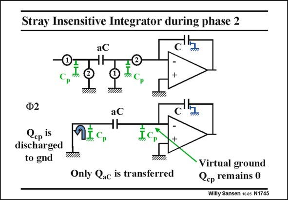

# SANSEN-1745 · Stray Insensitive Integrator during phase 2

章节：17 开关电容滤波器  
PDF 页：497；书本页：507；幻灯片编号：1745  
状态：unreviewed



## 对应教材讲解

### PDF 497 · 书本 507

The full integrator is again shown on top. The situation is now depicted during clock phase 2. The parasitic capacitor C p on the left of aC is shunted to ground. Its charge obtained during phase 1, disappears to ground. As a result, it does not affect charge on any capacitor. The parasitic capacitor C p on the right of aC is now connected to the minus input of the opamp. It is a low-impedance point because of the parallel feedback. It is called the ‘‘virtual ground’’. As a result, it does not affect charges an any capacitor either. Of course, this only holds if the gain of the opamp is sufficiently high. The parasitic capacitances have therefore no influence on the charge on capacitor aC or C. Only charge Q has been transferred. The capacitors can now be chosen smaller without loosing aC accuracy. In this way, power can be saved.

## 公式／性能结论候选摘录

以下为规则截取的原文，尚未逐项判读。

- PDF 497: As a result, it does not affect charge on any capacitor.
- PDF 497: As a result, it does not affect charges an any capacitor either.
- PDF 497: Of course, this only holds if the gain of the opamp is sufficiently high.
- PDF 497: The parasitic capacitances have therefore no influence on the charge on capacitor aC or C.

## 曲线结论候选摘录

以下为规则截取的原文，尚未逐项判读。

- PDF 497: The situation is now depicted during clock phase 2.
- PDF 497: Its charge obtained during phase 1, disappears to ground.

## 原文条件与近似候选摘录

以下为规则截取的原文，尚未逐项判读。

（未由规则找到；不代表原页没有此类内容。）

## 幻灯片 OCR（未校正）

```text
Stray Insensitive Integrator during phase 2
aC
+
P
Ф2
Cep is
discharged
to gnd
aC
ЧH
MIC
-
Only Qac is transferred
Virtual ground
Cep remains 0
Willy Sansen 1005 N1745
```

数学上下标、分数及正负号以原图为准。电路图已保留；未核对的连接不输出成可仿真 netlist。
