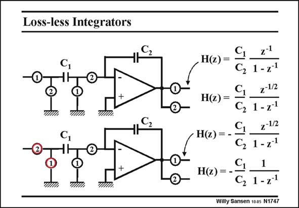

# SANSEN-1747 · Loss-less Integrators

章节：17 开关电容滤波器  
PDF 页：498；书本页：508；幻灯片编号：1747  
状态：unreviewed



## 对应教材讲解

### PDF 498 · 书本 508

Let us first investigate some variations on the integrators. Switches are now also connected to the output. They are actually the input switches of the next stage. They determine on which switch the output becomes available. The delay through the inverter is obviously affected by them. All the integrators in this slide have only a single capacitance in the feedback loop. This is why they are called ‘‘loss-less’’. They do not have a resister in the feedback loop which would ‘‘dampen’’ the integration. The top integrator with output on phase 1, has been discussed before. It has a non-inverting gain C /C , and half a clock delay. 1 2 However, when the output is sampled on phase 2, another half cock delay is added. The gain is again C /C , but the delay is now a full clock period. 1 2 In the bottom integrator, the two switches at the input have been interchanged. In clock phase 2, the well-known inverting amplifier configuration appears. It has gain C /C and no delay. 1 2 Taking the output on phase 1, adds half a clock period delay.

## 公式／性能结论候选摘录

以下为规则截取的原文，尚未逐项判读。

- PDF 498: It has a non-inverting gain C /C , and half a clock delay. 1 2 However, when the output is sampled on phase 2, another half cock delay is added.
- PDF 498: The gain is again C /C , but the delay is now a full clock period. 1 2 In the bottom integrator, the two switches at the input have been interchanged.
- PDF 498: It has gain C /C and no delay. 1 2 Taking the output on phase 1, adds half a clock period delay.

## 曲线结论候选摘录

以下为规则截取的原文，尚未逐项判读。

- PDF 498: The top integrator with output on phase 1, has been discussed before.
- PDF 498: It has a non-inverting gain C /C , and half a clock delay. 1 2 However, when the output is sampled on phase 2, another half cock delay is added.
- PDF 498: In clock phase 2, the well-known inverting amplifier configuration appears.
- PDF 498: It has gain C /C and no delay. 1 2 Taking the output on phase 1, adds half a clock period delay.

## 原文条件与近似候选摘录

以下为规则截取的原文，尚未逐项判读。

（未由规则找到；不代表原页没有此类内容。）

## 幻灯片 OCR（未校正）

```text
Loss-less Integrators
C,
H(z) =
C, 1-71
7-1/2
H(z) =
1-z1
H(2)= -
7-1/2
G, 1-2
1
HQ) = C, 1-z1
Willy Sansen 1005 N1747
```

数学上下标、分数及正负号以原图为准。电路图已保留；未核对的连接不输出成可仿真 netlist。
