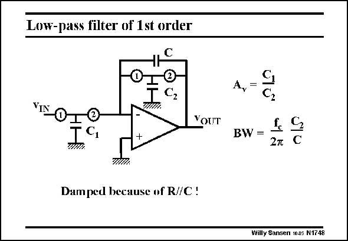

# SANSEN-1748 · Low-pass filter of 1st order

章节：17 开关电容滤波器  
PDF 页：499；书本页：509；幻灯片编号：1748  
状态：unreviewed



## 对应教材讲解

### PDF 499 · 书本 509

Addition of a switched resistor, with capacitor C2, across integration capacitor C, dampens the integration. It forms a first-order lowpass filter. The gain at low frequencies is non-inverting and equals C /C . The pole of 1 2 this filter (or the bandwidth) is a fraction of the clock frequency f , depending on the c ratio C /C . 1 2 Many more filters can be constructed in this way.

## 公式／性能结论候选摘录

以下为规则截取的原文，尚未逐项判读。

- PDF 499: The gain at low frequencies is non-inverting and equals C /C .
- PDF 499: The pole of 1 2 this filter (or the bandwidth) is a fraction of the clock frequency f , depending on the c ratio C /C . 1 2 Many more filters can be constructed in this way.

## 曲线结论候选摘录

以下为规则截取的原文，尚未逐项判读。

（未由规则找到；不代表原页没有此类内容。）

## 原文条件与近似候选摘录

以下为规则截取的原文，尚未逐项判读。

（未由规则找到；不代表原页没有此类内容。）

## 幻灯片 OCR（未校正）

```text
Low-pass filter of 1st order
VIN
О-
10
TC,
O-
IC,
WHA.
+
YOUT
Damped because of R//C!
A,=
BW =
2л
C
Willy Sansen 10.05 N1748
```

数学上下标、分数及正负号以原图为准。电路图已保留；未核对的连接不输出成可仿真 netlist。
