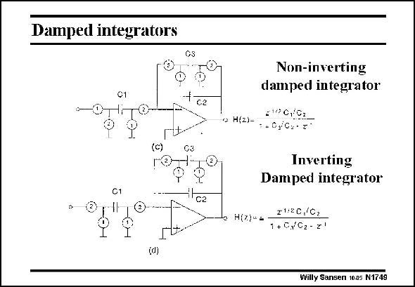

# SANSEN-1749 · Damped integrators

章节：17 开关电容滤波器  
PDF 页：499；书本页：509；幻灯片编号：1749  
状态：unreviewed



## 对应教材讲解

### PDF 499 · 书本 509

Two more examples are given in this slide. Both are first-order lowpass filters. Both have the same gain and cut-off frequency. The top one is noninverting however, because of the different switch arrangement. Some more complicated filter configurations will be discussed later.

## 公式／性能结论候选摘录

以下为规则截取的原文，尚未逐项判读。

- PDF 499: Both have the same gain and cut-off frequency.

## 曲线结论候选摘录

以下为规则截取的原文，尚未逐项判读。

（未由规则找到；不代表原页没有此类内容。）

## 原文条件与近似候选摘录

以下为规则截取的原文，尚未逐项判读。

（未由规则找到；不代表原页没有此类内容。）

## 幻灯片 OCR（未校正）

```text
Damped integrators
01
+ca
-O
(C)
C3
C1
C2
(d)
Non-inverting
damped integrator
• H(2)-
29G192
1. 0y/0.2'
Inverting
Damped integrator
H[z)-=
2120,/C2
1 + C/G2- z'
Willy Sansen 1005 N1749
```

数学上下标、分数及正负号以原图为准。电路图已保留；未核对的连接不输出成可仿真 netlist。
