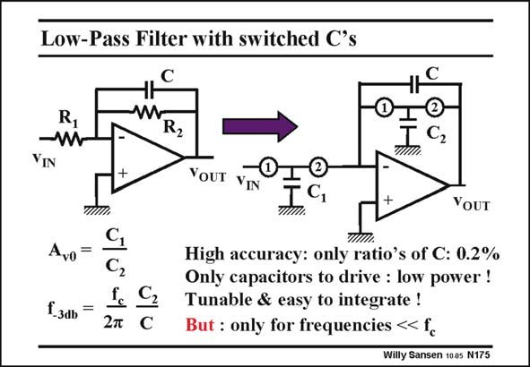

# SANSEN-175 · Low-Pass Filter with switched C's

章节：17 开关电容滤波器  
PDF 页：477；书本页：487；幻灯片编号：175  
状态：unreviewed



## 对应教材讲解

### PDF 477 · 书本 487

Substitution of all resistors by switched capacitors yields a circuit with only capacitors and switches, and an opamp. Substitution of all R’s in the expressions gives only C’s. The low-frequency gain A is now a ratio of capaciv0 tors, which can be made even more accurate, than a ratio of resistors. The cut-off frequency f now depends on a −3dB ratio of capacitors as well, and on the absolute value of clock frequency f . This latter frequency is normally derived from a crystal oscillator and is very c accurate indeed (see Chapter 22). The ratio of capacitors can be made quite accurate as well. The larger we make the capacitors in area the better the matching will be (see Chapter 15). Values of less than 0.2% can be reached. As a result, a fully integratable low-pass filter can be realized at low frequencies. There are only two drawbacks. It can only function at signal frequencies much lower than the clock frequency. Moreover the ratio of the signal frequency to the clock frequency is determined by a capacitor ratio. Large values of this ratio are not easy to realize. The signal frequency cannot thus allowed to be too large but not too small either! Finally, note how the charges flow in this circuit. On phase 1 the input voltage is stored on C . On phase 2 the node goes back to zero as it is connected to the input of the opamp. All the 1 charge of C is now transferred to capacitor C , which changes the output voltage accordingly. 1 2 The charge is conserved and hence C V =C V . 1 IN 2 OUT

## 公式／性能结论候选摘录

以下为规则截取的原文，尚未逐项判读。

- PDF 477: The low-frequency gain A is now a ratio of capaciv0 tors, which can be made even more accurate, than a ratio of resistors.
- PDF 477: The cut-off frequency f now depends on a −3dB ratio of capacitors as well, and on the absolute value of clock frequency f .
- PDF 477: As a result, a fully integratable low-pass filter can be realized at low frequencies.
- PDF 477: The signal frequency cannot thus allowed to be too large but not too small either!

## 曲线结论候选摘录

以下为规则截取的原文，尚未逐项判读。

- PDF 477: On phase 1 the input voltage is stored on C .
- PDF 477: On phase 2 the node goes back to zero as it is connected to the input of the opamp.

## 原文条件与近似候选摘录

以下为规则截取的原文，尚未逐项判读。

（未由规则找到；不代表原页没有此类内容。）

## 幻灯片 OCR（未校正）

```text
Low-Pass Filter with switched C's
R
R2
C2
TIM.
YIN
YOUT
IN
1.3ab
C2
Fc C2
2т C
YoUT
High accuracy: only ratio's of C: 0.2%
Only capacitors to drive : low power !
Tunable & easy to integrate !
But : only for frequencies «< fc
Willy Sansen 1005 N175
```

数学上下标、分数及正负号以原图为准。电路图已保留；未核对的连接不输出成可仿真 netlist。
