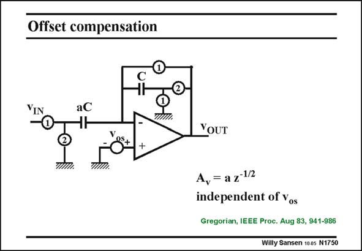

# SANSEN-1750 · Offset compensation

章节：17 开关电容滤波器  
PDF 页：500；书本页：510；幻灯片编号：1750  
状态：unreviewed



## 对应教材讲解

### PDF 500 · 书本 510

As the input signal is stored and amplified in the next clock phase, the offset voltage can also be stored and subtracted in the next phase. In this way, the offset of the opamp can be cancelled out. An example of such a cancellation circuit is shown in this slide. If the offset v were zero os then it is clear that the gain is accurately zero. In the presence of an offset voltage v , we want to discover os how much of this offset is measured at the output. For this purpose, charge conservation is applied.

## 公式／性能结论候选摘录

以下为规则截取的原文，尚未逐项判读。

- PDF 500: If the offset v were zero os then it is clear that the gain is accurately zero.

## 曲线结论候选摘录

以下为规则截取的原文，尚未逐项判读。

- PDF 500: As the input signal is stored and amplified in the next clock phase, the offset voltage can also be stored and subtracted in the next phase.

## 原文条件与近似候选摘录

以下为规则截取的原文，尚未逐项判读。

（未由规则找到；不代表原页没有此类内容。）

## 幻灯片 OCR（未校正）

```text
Offset compensation
VIN
aC
YOUT
A,= az12
independent of vos
Gregorian, IEEE Proc. Aug 83, 941-986
Willy Sansen 1005 N1750
```

数学上下标、分数及正负号以原图为准。电路图已保留；未核对的连接不输出成可仿真 netlist。
