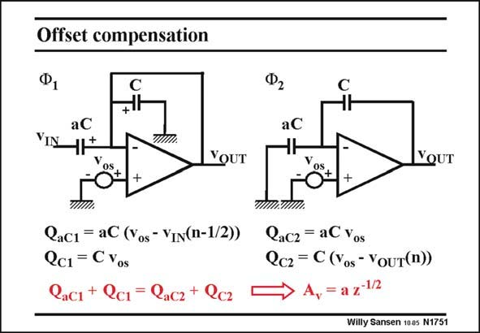

# SANSEN-1751 · Offset compensation

章节：17 开关电容滤波器  
PDF 页：500；书本页：510；幻灯片编号：1751  
状态：unreviewed



## 对应教材讲解

### PDF 500 · 书本 510

The same circuit is shown twice, once during clock phase 1 (on the left) and once during clock phase 2 (on the right). In both clock phases, the charges are written on both capacitors aC and C. The equation of the sum of the charges, shows that the offset voltage v cancels os altogether. Indeed, it appears in all terms. As a result it cancels out. This technique is also used to cancel the 1/f noise of MOST amplifiers. At very low frequencies, 1/f noise resembles offset. It is now cancelled out at the cost of a small increase of the thermal noise.

## 公式／性能结论候选摘录

以下为规则截取的原文，尚未逐项判读。

- PDF 500: As a result it cancels out.
- PDF 500: It is now cancelled out at the cost of a small increase of the thermal noise.

## 曲线结论候选摘录

以下为规则截取的原文，尚未逐项判读。

- PDF 500: The same circuit is shown twice, once during clock phase 1 (on the left) and once during clock phase 2 (on the right).

## 原文条件与近似候选摘录

以下为规则截取的原文，尚未逐项判读。

（未由规则找到；不代表原页没有此类内容。）

## 幻灯片 OCR（未校正）

```text
Offset compensation
VIN
aC
+
VIIl!
YOUT
Os
Cac1 = aC (Yos - VIN(n-1/2))
Qc1 = C Yos
Cac1 + Qc1 = Qacz+ Qcz
aC
YOUT
Qacz = aC Yos
Qc2 = C (Yos- YouT(n))
= a z-1/2
Willy Sansen 1005 N1751
```

数学上下标、分数及正负号以原图为准。电路图已保留；未核对的连接不输出成可仿真 netlist。
