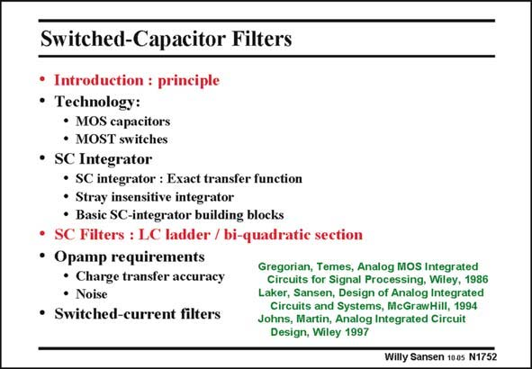

# SANSEN-1752 · Switched-Capacitor Filters

章节：17 开关电容滤波器  
PDF 页：501；书本页：511；幻灯片编号：1752  
状态：unreviewed



## 对应教材讲解

### PDF 501 · 书本 511

More complicated filters can also be constructed. They can basically be divided into ladder filters and biquads. Only a few examples are given here. For a more detailed treatment the reader is referred to the references in this slide, the last one of which is the most up-to-date.

## 公式／性能结论候选摘录

以下为规则截取的原文，尚未逐项判读。

（未由规则找到；不代表原页没有此类内容。）

## 曲线结论候选摘录

以下为规则截取的原文，尚未逐项判读。

（未由规则找到；不代表原页没有此类内容。）

## 原文条件与近似候选摘录

以下为规则截取的原文，尚未逐项判读。

（未由规则找到；不代表原页没有此类内容。）

## 幻灯片 OCR（未校正）

```text
Switched-Capacitor Filters
• Introduction : principle
• Technology:
• MOS capacitors
• MOST switches
• SC Integrator
• SC integrator : Exact transfer function
• Stray insensitive integrator
• Basic SC-integrator building blocks
• SC Filters : LC ladder / bi-quadratic section
• Opamp requirements
• Charge transfer accuracy
• Noise
• Switched-current filters
Gregorian, Temes, Analog MOS Integrated
Circuits for Signal Processing, Wiley, 1986
Laker, Sansen, Design of Analog Integrated
Circuits and Systems, McGrawHill, 1994
Johns, Martin, Analog Integrated Circuit
Design, Wiley 1997
Willy Sansen 1005 N1752
```

数学上下标、分数及正负号以原图为准。电路图已保留；未核对的连接不输出成可仿真 netlist。
