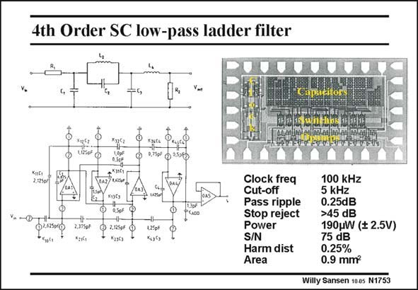

# SANSEN-1753 · 4th Order SC low-pass ladder filter

章节：17 开关电容滤波器  
PDF 页：501；书本页：511；幻灯片编号：1753  
状态：unreviewed



## 对应教材讲解

### PDF 501 · 书本 511

One example of a ladder filter is shown in this slide. It has been shown at the beginning of this Chapter. Ladder filters have the advantage that they are relatively insensitive to errors in the coefficients, or the actual component values. They are normally of odd order although even-order ones are possible as well. This is a single-ended one. Nowadays, preference is given to fully-differential ones to reject substrate noise. The power consumption is about 50 mW per pole. Values down to 25 mW have also been achieved. This is only possible however, if class AB opamps are used in both the input AND output stages.

## 公式／性能结论候选摘录

以下为规则截取的原文，尚未逐项判读。

（未由规则找到；不代表原页没有此类内容。）

## 曲线结论候选摘录

以下为规则截取的原文，尚未逐项判读。

（未由规则找到；不代表原页没有此类内容。）

## 原文条件与近似候选摘录

以下为规则截取的原文，尚未逐项判读。

（未由规则找到；不代表原页没有此类内容。）

## 幻灯片 OCR（未校正）

```text
4th Order SC low-pass ladder filter
eapsicitor
hala ls mlnt ebe
332.
XyCa
KiGr
2.12501
&sot
V -@-
125pF
Clock freq
Cut-off
Pass ripple
Stop reject
Power
S/N
Harm dist
Area
100 kHz
5 kHz
0.25dB
>45 dB
190pW ($ 2.5V)
75 dB
0.25%
0.9 mm?
Willy Sansen 100s N1753
```

数学上下标、分数及正负号以原图为准。电路图已保留；未核对的连接不输出成可仿真 netlist。
