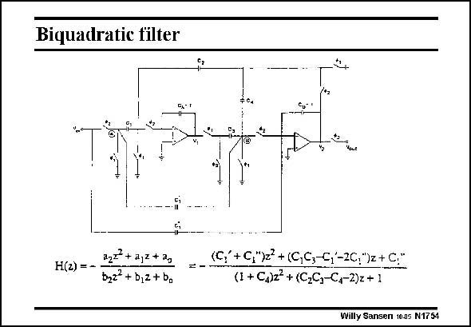

# SANSEN-1754 · Biquadratic filter

章节：17 开关电容滤波器  
PDF 页：502；书本页：512；幻灯片编号：1754  
状态：unreviewed



## 对应教材讲解

### PDF 502 · 书本 512

An alternative circuit configuration is a biquadratic filter. It is a second-order filter configuration with local and overall feedback. It contains two operational amplifiers, as shown in this slide. The transfer characteristic is of second-order in both the numerator and denominator. It has two poles and zeros. Filter design consists of positioning the poles and zeros accordingly. The reader is referred to the general references on the introductory slide. For higher-order filters, several biquads can be cascaded. Finally, note that the C’s in the expression refer to capacitor ratios. The unit capacitance has to be selected. It is usually around 0.25 pF. Nowadays, such filters are realized in a fulyl-differential version to reject substrate noise.

## 公式／性能结论候选摘录

以下为规则截取的原文，尚未逐项判读。

（未由规则找到；不代表原页没有此类内容。）

## 曲线结论候选摘录

以下为规则截取的原文，尚未逐项判读。

- PDF 502: The transfer characteristic is of second-order in both the numerator and denominator.

## 原文条件与近似候选摘录

以下为规则截取的原文，尚未逐项判读。

（未由规则找到；不代表原页没有此类内容。）

## 幻灯片 OCR（未校正）

```text
Biquadratic filter
-$
H(2) = -
a2? + a,2 + 2,
b3z + b,2 + bo
=-
(G: + G,)2 + (C,C,-S(-2C;")2+C:"
(1+ C,)z + (C2C,-C,-2)z+ 1
Willy Sansen 10.05 N1754
```

数学上下标、分数及正负号以原图为准。电路图已保留；未核对的连接不输出成可仿真 netlist。
