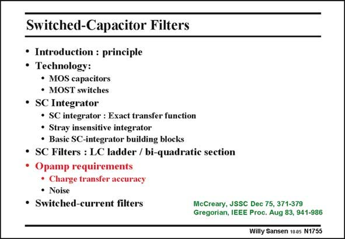

# SANSEN-1755 · Switched-Capacitor Filters

章节：17 开关电容滤波器  
PDF 页：502；书本页：512；幻灯片编号：1755  
状态：unreviewed



## 对应教材讲解

### PDF 502 · 书本 512

Finally, we have to have a look at the specifications of the opamps used in such switched-capacitor filters. After all, they take most of the power consumption. They are necessary to guarantee full charge transfer from the input (sampling) capacitor to the output (integration) capacitor. They need therefore high gain and low offset. Moreover, they have to settle to within 0.05% in as short a time as possible, to allow use of high-frequency clocks. This is now discussed in more detail.

## 公式／性能结论候选摘录

以下为规则截取的原文，尚未逐项判读。

- PDF 502: They need therefore high gain and low offset.

## 曲线结论候选摘录

以下为规则截取的原文，尚未逐项判读。

（未由规则找到；不代表原页没有此类内容。）

## 原文条件与近似候选摘录

以下为规则截取的原文，尚未逐项判读。

（未由规则找到；不代表原页没有此类内容。）

## 幻灯片 OCR（未校正）

```text
Switched-Capacitor Filters
• Introduction : principle
• Technology:
• MOS capacitors
• MOST switches
• SC Integrator
• SC integrator : Exact transfer function
• Stray insensitive integrator
• Basic SC-integrator building blocks
• SC Filters : LC ladder / bi-quadratic section
• Opamp requirements
• Charge transfer accuracy
• Noise
• Switched-current filters
McCreary, JSSC Dec 75, 371-379
Gregorian, IEEE Proc. Aug 83, 941-986
Willy Sansen 100s N1755
```

数学上下标、分数及正负号以原图为准。电路图已保留；未核对的连接不输出成可仿真 netlist。
