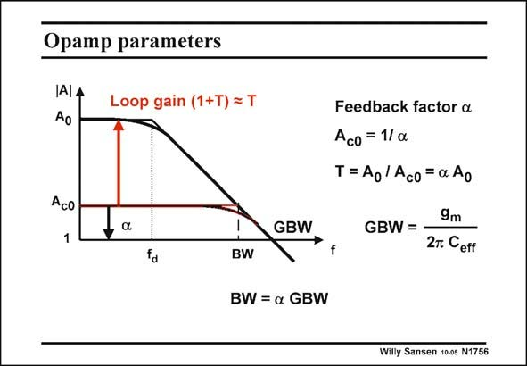

# SANSEN-1756 · Opamp parameters

章节：17 开关电容滤波器  
PDF 页：503；书本页：513；幻灯片编号：1756  
状态：unreviewed



## 对应教材讲解

### PDF 503 · 书本 513

When feedback is used around an operational amplifier with gain-bandwidth product GBW, the closed-loop gain A is the c0 inverse of the feedback factor a. This is the ratio between the bandwidth BW and the GBW. The loop gain T is then the difference (in dB) between the open-loop gain A and the closed-loop gain 0 A . It is also given by aA . c0 0 The loop gain T will determine the accuracy at low frequency or the static accuracy. The bandwidth will determine the settling time. For example, take a closed-loop gain of 5, which corresponds to a=0.2. For A =104, the loop 0 gain is 2000 or 66 dB. If the GBW=1 MHz, then the BW is 0.2 MHz. Also, the dominant pole f is at 100 Hz. At this frequency, the loop gain starts decreasing, to become unity at 0.2 MHz. d

## 公式／性能结论候选摘录

以下为规则截取的原文，尚未逐项判读。

- PDF 503: When feedback is used around an operational amplifier with gain-bandwidth product GBW, the closed-loop gain A is the c0 inverse of the feedback factor a.
- PDF 503: This is the ratio between the bandwidth BW and the GBW.
- PDF 503: The loop gain T is then the difference (in dB) between the open-loop gain A and the closed-loop gain 0 A .
- PDF 503: It is also given by aA . c0 0 The loop gain T will determine the accuracy at low frequency or the static accuracy.
- PDF 503: The bandwidth will determine the settling time.
- PDF 503: For example, take a closed-loop gain of 5, which corresponds to a=0.2.
- PDF 503: For A =104, the loop 0 gain is 2000 or 66 dB.
- PDF 503: At this frequency, the loop gain starts decreasing, to become unity at 0.2 MHz. d

## 曲线结论候选摘录

以下为规则截取的原文，尚未逐项判读。

（未由规则找到；不代表原页没有此类内容。）

## 原文条件与近似候选摘录

以下为规则截取的原文，尚未逐项判读。

（未由规则找到；不代表原页没有此类内容。）

## 幻灯片 OCR（未校正）

```text
Opamp parameters
IA| A
Ao
Loop gain (1+T) = T
Aco
1
, a
GBW
Feedback factor a
Ac0 = 1/ a
T= Ao/ Aco=a Ao
f
9m
GBW = -
2m Ceff
fa
BW
BW = a GBW
Willy Sansen 10-05 N1756
```

数学上下标、分数及正负号以原图为准。电路图已保留；未核对的连接不输出成可仿真 netlist。
