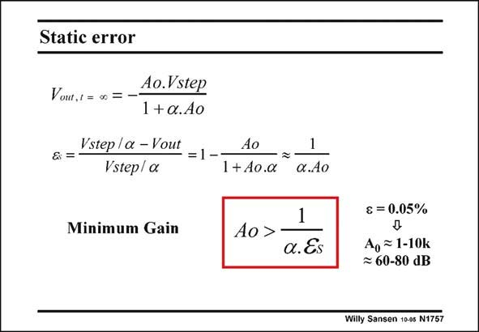

# SANSEN-1757 · Static error

章节：17 开关电容滤波器  
PDF 页：503；书本页：513；幻灯片编号：1757  
状态：unreviewed



## 对应教材讲解

### PDF 503 · 书本 513

The static accuracy e for a S step input with amplitude V , is now given by the step inverse of the loop gain or by the inverse of aA . 0 For a minimum static accuracy e , there is a mini- S mum amount of gain A 0 required. For example, for e =0.05% we need a loop S gain of the inverse or 2000. For a closed-loop gain of 5 (a=0.2) the open-loop gain A must be 104. 0 Since open-loop gains are not accurately known, a safety factor has to be included of 3–5. The open-loop gain must therefore be 3×104 or 90 dB.

## 公式／性能结论候选摘录

以下为规则截取的原文，尚未逐项判读。

- PDF 503: The static accuracy e for a S step input with amplitude V , is now given by the step inverse of the loop gain or by the inverse of aA . 0 For a minimum static accuracy e , there is a mini- S mum amount of gain A 0 required.
- PDF 503: For example, for e =0.05% we need a loop S gain of the inverse or 2000.
- PDF 503: For a closed-loop gain of 5 (a=0.2) the open-loop gain A must be 104. 0 Since open-loop gains are not accurately known, a safety factor has to be included of 3–5.
- PDF 503: The open-loop gain must therefore be 3×104 or 90 dB.

## 曲线结论候选摘录

以下为规则截取的原文，尚未逐项判读。

（未由规则找到；不代表原页没有此类内容。）

## 原文条件与近似候选摘录

以下为规则截取的原文，尚未逐项判读。

（未由规则找到；不代表原页没有此类内容。）

## 幻灯片 OCR（未校正）

```text
Static error
Vout, / = 0 =
Ao.Vstep
1+a.Ao
Vstep / a - Vout
& =
Vstep/ a
Minimum Gain
Ao
=1--
1+ Ao.a
1
a.Ao
1
Ao >-
a. Es
€= 0.05%
A, ~ 1-10k
≥ 60-80 dB
Willy Sansen 1095 N1757
```

数学上下标、分数及正负号以原图为准。电路图已保留；未核对的连接不输出成可仿真 netlist。
