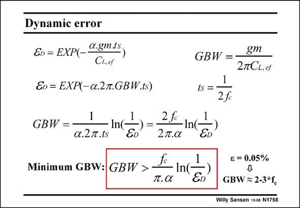

# SANSEN-1758 · Dynamic error

章节：17 开关电容滤波器  
PDF 页：504；书本页：514；幻灯片编号：1758  
状态：unreviewed



## 对应教材讲解

### PDF 504 · 书本 514

It takes a time t , which s includes a number of time constants, before the exponential of the voltage across the output capacitor reaches its final value. For a deviation of 0.1%, approximately 7 time constants are required. This deviation is called the dynamic error e . D A typical value is again 0.05%. The time constant itself is 1/(2pBW) in which the BW equals aGBW. For a singlestage opamp the GBW is determined by the load capacitances, as given in this slide. The maximum value of settling time t is half the clock period, which is the inverse of the s clock frequency f . c A minimum value is now required for the GBW. The corresponding time constant must be sufficiently small to be able to reach settling with sufficient dynamic accuracy within half a clock period. The expression is given in this slide. For example, the term ln(1/e ) is about 7 for 0.1% but 7.6 for 0.05%. For a=0.2, the GBW D must be about 12 times f . If a were unity, then 2.4 times f would be sufficient. This is where c c the rule of thumb is coming from that the GBW must be 2–3 times the clock frequency f . c

## 公式／性能结论候选摘录

以下为规则截取的原文，尚未逐项判读。

- PDF 504: The time constant itself is 1/(2pBW) in which the BW equals aGBW.

## 曲线结论候选摘录

以下为规则截取的原文，尚未逐项判读。

（未由规则找到；不代表原页没有此类内容。）

## 原文条件与近似候选摘录

以下为规则截取的原文，尚未逐项判读。

- PDF 504: For a deviation of 0.1%, approximately 7 time constants are required.

## 幻灯片 OCR（未校正）

```text
Dynamic error
En = EXP(_Q.gm.ts
C1,eT
En = EXP(-a.2.GBW.ts)
1
GBW =
a.2m.ts
2 f.
2п.а
In
ED
fc
Minimum GBW: GBW >
-In(!
п.а
ED
GBW =-
gm
2CL.et
1
ts =•
2fc
& = 0.05%
GBW ≥ 2-3*fc
Willy Sansen 10.as N1758
```

数学上下标、分数及正负号以原图为准。电路图已保留；未核对的连接不输出成可仿真 netlist。
