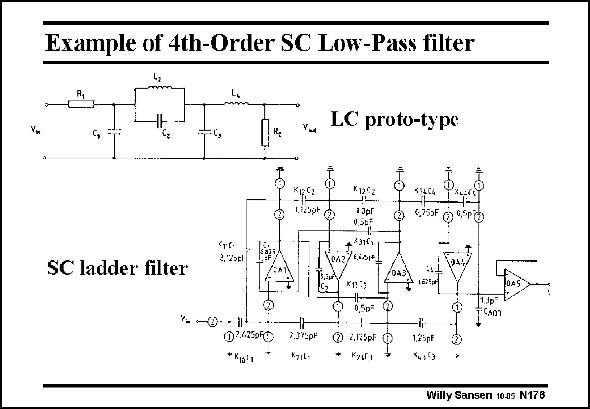

# SANSEN-176 · Example of 4th-Order SC Low-Pass filter

章节：17 开关电容滤波器  
PDF 页：477；书本页：487；幻灯片编号：176  
状态：unreviewed



## 对应教材讲解

### PDF 477 · 书本 487

As an example, a 4th order LC ladder filter is shown with its switched-capacitor equivalent. There is an opamp with switched capacitors all around. Opamp OA5 is just an output buffer. Note that this filter involves only capacitor ratios. The smallest one has to be chosen. In this example, it is 0.5 pF. The smaller this minimum capacitor or unit capacitor is chosen, the more parasitic capacitances will cause errors in the

### PDF 478 · 书本 488

capacitor ratios. Nowadays, unit capacitors of 0.2–0.25 pF are common for errors of the order of 0.05%. Also, the opamps only drive small capacitors, which are different however in phase 1 compared with phase 2. The largerst has to be taken into account when designing such an opamp. The smaller the capacitors however, the lower the power consumption.

## 公式／性能结论候选摘录

以下为规则截取的原文，尚未逐项判读。

（未由规则找到；不代表原页没有此类内容。）

## 曲线结论候选摘录

以下为规则截取的原文，尚未逐项判读。

- PDF 478: Also, the opamps only drive small capacitors, which are different however in phase 1 compared with phase 2.

## 原文条件与近似候选摘录

以下为规则截取的原文，尚未逐项判读。

（未由规则找到；不代表原页没有此类内容。）

## 幻灯片 OCR（未校正）

```text
Example of 4th-Order SC Low-Pass filter
LC proto-type
2.25el
SC ladder filter
+-0--1-
02.4250F€
*Xio'
Lіbs C
*922
13pl
0.51
Voi / n6
K1:3
0.5D 0
t3p C 415pF Ф
Kz1L-
* Kуt,
O 45F 0°0
OA3V
-301
1,23pF
Willy Sansen 1005 N178
```

数学上下标、分数及正负号以原图为准。电路图已保留；未核对的连接不输出成可仿真 netlist。
